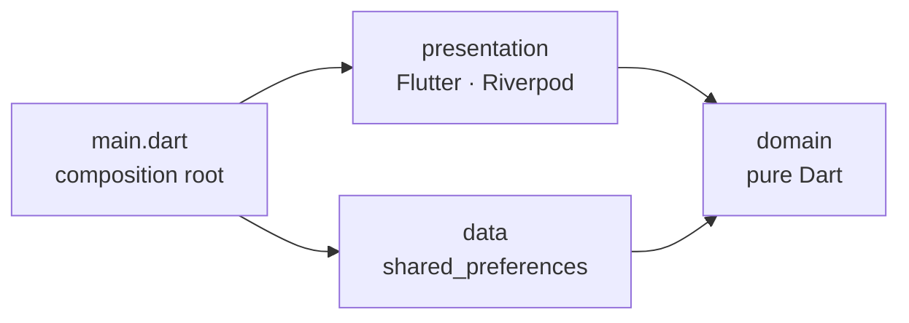

# Tic-Tac-Toe

A Flutter Tic-Tac-Toe game against a computer opponent, built as a showcase
of Clean Architecture and production-grade engineering practices.

- Human vs CPU, with three difficulty levels (the hardest never loses)
- Pick X or O — X always opens, so picking O lets the CPU start
- Persistent score (wins, draws, losses)
- English and French, light and dark themes, screen-reader friendly

## Getting started

Requires Flutter **3.44.1** (Dart 3.12).

```bash
flutter pub get          # also generates the localizations
flutter run              # on a simulator, an emulator or a device
```

| Task | Command |
|---|---|
| Unit and widget tests | `flutter test` |
| Tests with coverage | `flutter test --coverage` |
| Integration test (needs a device or simulator) | `flutter test integration_test` |
| Static analysis | `flutter analyze` |
| Formatting check | `dart format --output=none --set-exit-if-changed .` |

CI (`.github/workflows/ci.yml`) runs formatting, analysis and tests on every
push and pull request, and fails below 90 % line coverage.

## Architecture

The code follows Clean Architecture: three layers, with dependencies
pointing inwards only.



| Layer | Contents | May import |
|---|---|---|
| `lib/domain` | Entities (`Board`, `Game`, `GameStatus`, `Score`…), the CPU strategies, the `ScoreRepository` port and the use cases (`PlayCpuTurn`, `GetScore`, `RecordGameOutcome`) | Dart only (`equatable`) |
| `lib/data` | `SharedPreferencesScoreRepository` and its JSON `ScoreDto` | domain |
| `lib/presentation` | Riverpod providers (the dependency graph), controllers, pages and widgets | domain, l10n |
| `lib/main.dart` | Composition root: builds the data layer and injects it by overriding `scoreRepositoryProvider` | everything |

`test/architecture_test.dart` fails the build if a layer imports something
it should not.

```text
lib/
  main.dart
  domain/        entities/ ai/ repositories/ usecases/
  data/          models/ repositories/
  l10n/          app_en.arb app_fr.arb l10n.dart
  presentation/  providers.dart app.dart theme.dart labels.dart
                 home/ game/ score/
```

### Game flow

1. `HomePage` builds a `GameSettings` (mark + difficulty) and opens
   `GamePage`.
2. `GamePage` watches `gameControllerProvider(settings)`: an auto-dispose
   `Notifier` holding an immutable `Game`.
3. A human tap calls `GameController.play`. If it is then the CPU's turn,
   the controller waits 600 ms and runs the `PlayCpuTurn` use case, which
   asks the difficulty's `MoveStrategy` for a cell.
4. When the game ends, the outcome goes through `ScoreController` to
   `RecordGameOutcome`, which updates the stored score.

### The CPU

| Difficulty | Strategy |
|---|---|
| Easy | `RandomMoveStrategy` — any empty cell |
| Medium | `WinOrBlockMoveStrategy` — wins if it can, blocks if it must, otherwise random |
| Hard | `MinimaxMoveStrategy` — negamax with alpha-beta pruning; quicker wins score higher. A test plays it against every possible opponent line, as X and as O, and checks that it never loses. |

## Technical choices

| Topic | Choice | Why |
|---|---|---|
| State and DI | `flutter_riverpod` 3, hand-written providers | Type-safe dependency injection that tests can override; no code generation needed at this size |
| Models | Immutable classes and `equatable`; `sealed` `GameStatus` | Value equality and exhaustive `switch` checked by the compiler |
| Turn order | Derived from the marks on the board | A single source of truth, so the turn can never disagree with the board |
| Persistence | `shared_preferences`, JSON under a versioned key | Enough for a score; unreadable data falls back to zero instead of crashing |
| Testability | `Random` and the CPU delay are providers | Deterministic CPU moves and timing in tests (`fake_async`) |
| Lints | `very_good_analysis` | A strict, widely used rule set |
| i18n | gen-l10n with ARB files | The standard Flutter approach |

## Testing

| Level | Covers |
|---|---|
| Domain unit tests | Board rules, game status, turn order, each strategy, use cases |
| Data unit tests | Save/load round trip, storage format, corrupted data |
| Controller tests | CPU delay, ignored taps, score recording, restart, cleanup on dispose |
| Widget tests | Board (taps, sizing, semantics), status text, game and home pages, French locale |
| Integration test | A full game against the Hard CPU on a real device, score persisted |

## Trade-offs and next steps

- **Crash reporting and analytics** would plug into `main.dart`
  (`FlutterError.onError`, `PlatformDispatcher.instance.onError`).
- **Settings and in-progress games** are not persisted; both would reuse the
  repository pattern used for the score.
- **Minimax runs on the UI isolate.** Its worst case, an empty 3x3 board,
  takes about 2.5 ms on a laptop, well under a 16 ms frame. Larger boards
  would need an isolate (`compute`) or a depth-limited search.
- **Release setup** (flavors, signing, app icon, splash screen) is out of
  scope for this exercise.
