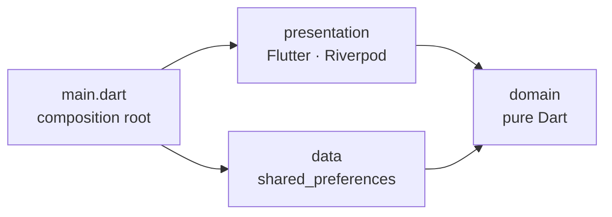

# Tic-Tac-Toe (Human vs CPU) Implementation Plan

> **For agentic workers:** REQUIRED SUB-SKILL: Use superpowers:subagent-driven-development (recommended) or superpowers:executing-plans to implement this plan task-by-task. Steps use checkbox (`- [ ]`) syntax for tracking.

**Goal:** Build a production-grade Flutter Tic-Tac-Toe app in which a human plays locally against a CPU opponent with three difficulty levels, structured with Clean Architecture.

**Architecture:** Three layers under `lib/`. A pure-Dart `domain` layer (immutable entities, CPU strategies behind a `MoveStrategy` port, a `ScoreRepository` port, use cases); a `data` layer implementing the repository with `shared_preferences`; a Flutter `presentation` layer whose Riverpod 3 providers form the dependency graph. `lib/main.dart` is the composition root: it injects the data implementation by overriding a provider, so `presentation` never imports `data`.

**Tech Stack:** Flutter 3.44.1 / Dart 3.12, flutter_riverpod 3.4, equatable 3, shared_preferences 2.5, flutter_localizations + gen-l10n, very_good_analysis 10.3, fake_async, integration_test, GitHub Actions.

**Spec:** `docs/superpowers/specs/2026-09-29-tictactoe-design.md`

## Global Constraints

- Flutter **3.44.1** (stable), Dart SDK constraint **`^3.12.1`**.
- Package name **`tic_tac_toe`**, org **`dev.lucchini`**, platforms **android, ios**.
- Dependencies exactly as in Task 1's `pubspec.yaml`: `equatable ^3.0.0`, `flutter_riverpod ^3.4.3`, `shared_preferences ^2.5.5`, `intl ^0.20.2`, `flutter_localizations` (sdk); dev: `fake_async ^1.3.3`, `flutter_test` (sdk), `integration_test` (sdk), `very_good_analysis ^10.3.0`. Do not add others.
- Lints: `very_good_analysis` with only `public_member_api_docs` and `one_member_abstracts` disabled. `flutter analyze` must print `No issues found!` before every commit.
- `dart format .` must leave every file unchanged before every commit (80-column lines).
- In `lib/`, always import with `package:tic_tac_toe/...` (never relative). Tests import `lib/` with `package:` and test helpers with relative paths.
- Dependency rule: `lib/domain` imports no Flutter, Riverpod, `shared_preferences`, `lib/data`, `lib/l10n` or `lib/presentation`. `lib/data` imports no Riverpod, `lib/l10n` or `lib/presentation`. `lib/presentation` imports no `shared_preferences` or `lib/data`. Only `lib/main.dart` sees every layer.
- Product rules: X always moves first; CPU delay 600 ms; difficulties Easy = random, Medium = win-or-block-else-random, Hard = minimax (never loses); score = wins/draws/losses persisted under the key `score.v1`; English + French.

## How to use this plan

- Run every command from the repository root: `/Users/a.lucchini/Projects/TicTacToe`.
- All code below was compiled, formatted, analyzed and tested with Flutter 3.44.1 before this plan was written. Copy it exactly. If something fails, first look for a transcription difference.
- Each task follows the same loop: write the failing test, watch it fail, write the code, watch it pass, format + analyze, commit.
- Commit messages follow Conventional Commits and end with the trailer shown in each commit step.
- Test counts: "`+N: All tests passed!`" is the last line `flutter test` prints. The expected `N` is given for the task's own test files and for the full suite.

## File Map

| File | Responsibility | Task |
|---|---|---|
| `pubspec.yaml`, `analysis_options.yaml`, `.gitignore` | Dependencies, lints, ignored files | 1 |
| `lib/domain/entities/mark.dart` | `Mark` enum (X/O) and `opponent` | 2 |
| `lib/domain/entities/invalid_move_exception.dart` | Rule-violation exception | 2 |
| `lib/domain/entities/board.dart` | Immutable 3x3 `Board`, `WinningLine` | 2 |
| `lib/domain/entities/difficulty.dart` | `Difficulty` enum | 3 |
| `lib/domain/entities/game_outcome.dart` | `GameOutcome` enum (human's view) | 3 |
| `lib/domain/entities/game_settings.dart` | Human mark + difficulty | 3 |
| `lib/domain/entities/game_status.dart` | Sealed `GameStatus` (in progress / won / drawn) | 3 |
| `lib/domain/entities/game.dart` | `Game` aggregate: board + settings, turns, outcome | 3 |
| `lib/domain/ai/move_strategy.dart` | `MoveStrategy` port | 4 |
| `lib/domain/ai/random_move_strategy.dart` | Easy strategy | 4 |
| `lib/domain/ai/win_or_block_move_strategy.dart` | Medium strategy | 4 |
| `lib/domain/ai/minimax_move_strategy.dart` | Hard strategy | 5 |
| `lib/domain/usecases/play_cpu_turn.dart` | CPU plays its move | 6 |
| `lib/domain/entities/score.dart` | `Score` value (wins/losses/draws) | 7 |
| `lib/domain/repositories/score_repository.dart` | `ScoreRepository` port | 7 |
| `lib/domain/usecases/get_score.dart`, `record_game_outcome.dart` | Score use cases | 7 |
| `lib/data/models/score_dto.dart` | JSON mapping of `Score` | 8 |
| `lib/data/repositories/shared_preferences_score_repository.dart` | `ScoreRepository` on `shared_preferences` | 8 |
| `lib/presentation/providers.dart` | Riverpod dependency graph | 9 |
| `lib/presentation/score/score_controller.dart` | Score state (`AsyncNotifier`) | 9 |
| `lib/presentation/game/game_controller.dart` | One game's state and CPU turn scheduling | 10 |
| `l10n.yaml`, `lib/l10n/app_en.arb`, `lib/l10n/app_fr.arb`, `lib/l10n/l10n.dart` | Localization | 11 |
| `lib/presentation/labels.dart` | Display names of domain enums | 11 |
| `lib/presentation/theme.dart` | Light/dark Material 3 themes | 11 |
| `lib/presentation/game/widgets/board_view.dart` | The 3x3 grid widget | 11 |
| `lib/presentation/game/widgets/game_status_text.dart` | Status line | 12 |
| `lib/presentation/game/game_page.dart` | Game screen | 12 |
| `lib/presentation/score/score_board.dart` | Score card | 13 |
| `lib/presentation/home/home_page.dart` | Setup screen | 13 |
| `lib/presentation/app.dart` | `MaterialApp` | 14 |
| `lib/main.dart` | Composition root | 14 |
| `ios/Runner/Info.plist`, `android/app/src/main/AndroidManifest.xml` | Display name, iOS locales | 14 |
| `integration_test/app_test.dart` | Full game on a device | 15 |
| `test/architecture_test.dart` | Enforces the dependency rule | 16 |
| `.github/workflows/ci.yml`, `README.md` | CI and documentation | 16 |
| `test/helpers/*.dart` | Test doubles and builders | 2, 4, 7, 11 |

---

### Task 1: Project scaffold and tooling

**Files:**
- Create (generated): the Flutter project via `flutter create`
- Replace: `pubspec.yaml`, `analysis_options.yaml`
- Modify: `.gitignore` (append)

**Interfaces:**
- Consumes: nothing.
- Produces: a Flutter package named `tic_tac_toe` (imports are `package:tic_tac_toe/...`), all dependencies installed, strict lints active. `flutter pub get` will generate localizations once Task 11 adds `l10n.yaml` (`generate: true` is set now and is harmless before that).

- [ ] **Step 1: Initialize git and generate the Flutter project in place**

The directory already contains `docs/` (the spec and this plan) and `.claude/` (local Claude Code settings, which must not be committed).

```bash
git init -b main
flutter create --org dev.lucchini --project-name tic_tac_toe --platforms=android,ios --empty .
```

Expected output ends with: `Your empty application code is in ./lib/main.dart.` The `--empty` template has no `test/` directory; Task 2 creates it. Run `flutter create` before writing any `.gitignore`: it does not touch an existing one, so Flutter's own ignore rules would be lost.

- [ ] **Step 2: Commit the design docs on their own**

```bash
git add docs
git commit -m "docs: add Tic-Tac-Toe design spec and implementation plan" -m "Co-authored-by: Claude <claude@anthropic.com>"
```

- [ ] **Step 3: Replace `pubspec.yaml`**

```yaml
name: tic_tac_toe
description: "Tic-Tac-Toe against the CPU, built with Clean Architecture."
publish_to: 'none'
version: 1.0.0+1

environment:
  sdk: ^3.12.1

dependencies:
  equatable: ^3.0.0
  flutter:
    sdk: flutter
  flutter_localizations:
    sdk: flutter
  flutter_riverpod: ^3.4.3
  intl: ^0.20.2
  shared_preferences: ^2.5.5

dev_dependencies:
  fake_async: ^1.3.3
  flutter_test:
    sdk: flutter
  integration_test:
    sdk: flutter
  very_good_analysis: ^10.3.0

flutter:
  generate: true
  uses-material-design: true
```

- [ ] **Step 4: Replace `analysis_options.yaml`**

```yaml
include: package:very_good_analysis/analysis_options.yaml

analyzer:
  exclude:
    # Generated by `flutter gen-l10n` from the .arb files.
    - lib/l10n/app_localizations*.dart

linter:
  rules:
    # This is an application, not a published package: API docs are written
    # where they add value, not on every public member.
    public_member_api_docs: false
    # Single-method interfaces (e.g. MoveStrategy) are deliberate ports
    # between layers, not accidental abstractions.
    one_member_abstracts: false
```

- [ ] **Step 5: Extend `.gitignore`**

Append to the generated `.gitignore`:

```gitignore

# Local Claude Code settings.
/.claude/settings.local.json

# Generated by `flutter gen-l10n` (runs on `flutter pub get`).
/lib/l10n/app_localizations*.dart
```

- [ ] **Step 6: Install dependencies and verify the toolchain**

```bash
flutter pub get
dart format --output=none --set-exit-if-changed .
flutter analyze
```

Expected: `pub get` ends with `Got dependencies!` (notes about newer incompatible versions are fine); format prints `0 changed`; analyze prints `No issues found!` (the template `lib/main.dart` is lint-clean and is replaced in Task 14).

- [ ] **Step 7: Commit**

`git status --short` must not list `.claude/settings.local.json`.

```bash
git add -A
git commit -m "chore: scaffold Flutter app with strict lints and dependencies" -m "Co-authored-by: Claude <claude@anthropic.com>"
```

---

### Task 2: Board domain model

**Files:**
- Create: `lib/domain/entities/mark.dart`, `lib/domain/entities/invalid_move_exception.dart`, `lib/domain/entities/board.dart`
- Create (test helper): `test/helpers/board_builder.dart`
- Test: `test/domain/entities/mark_test.dart`, `test/domain/entities/board_test.dart`

**Interfaces:**
- Consumes: `package:equatable/equatable.dart`.
- Produces:
  - `enum Mark { x, o }` with `Mark get opponent`.
  - `class InvalidMoveException implements Exception` — `const InvalidMoveException(String message)`, `final String message`.
  - `class WinningLine extends Equatable` — `const WinningLine({required Mark mark, required List<int> cells})`.
  - `class Board extends Equatable` — `Board.empty()`, `Board.fromCells(List<Mark?> cells)`, `static const int cellCount = 9`, `static const List<List<int>> lines`, `final List<Mark?> cells` (unmodifiable), `Mark? operator [](int index)`, `bool isEmptyAt(int index)`, `List<int> get emptyCells`, `bool get isFull`, `Mark get nextMark` (X when counts are equal), `WinningLine? get winningLine`, `Board place(int index, Mark mark)` (throws `RangeError` outside 0–8, `InvalidMoveException` on a taken cell).
  - Test helper `Board boardOf(String layout)` — 9 symbols `X`, `O`, `.`, row by row, whitespace ignored.

Cell indexes, used everywhere in this plan:

```text
 0 | 1 | 2
 3 | 4 | 5
 6 | 7 | 8
```

- [ ] **Step 1: Write the test helper**

`test/helpers/board_builder.dart`:

````dart
import 'package:tic_tac_toe/domain/entities/board.dart';
import 'package:tic_tac_toe/domain/entities/mark.dart';

/// Builds a [Board] from a readable layout: `X`, `O` or `.` per cell, row by
/// row. Whitespace is ignored.
///
/// ```dart
/// final board = boardOf('''
///   X O .
///   . X .
///   . . O
/// ''');
/// ```
Board boardOf(String layout) {
  final symbols = layout.replaceAll(RegExp(r'\s'), '').split('');
  if (symbols.length != Board.cellCount) {
    throw ArgumentError.value(layout, 'layout', 'must describe 9 cells');
  }
  return Board.fromCells([
    for (final symbol in symbols)
      switch (symbol) {
        'X' => Mark.x,
        'O' => Mark.o,
        '.' => null,
        _ => throw ArgumentError.value(symbol, 'layout', 'unknown symbol'),
      },
  ]);
}
````

- [ ] **Step 2: Write the failing tests**

`test/domain/entities/mark_test.dart`:

```dart
import 'package:flutter_test/flutter_test.dart';
import 'package:tic_tac_toe/domain/entities/mark.dart';

void main() {
  group('Mark', () {
    test('opponent of X is O and vice versa', () {
      expect(Mark.x.opponent, Mark.o);
      expect(Mark.o.opponent, Mark.x);
    });
  });
}
```

`test/domain/entities/board_test.dart`:

```dart
import 'package:flutter_test/flutter_test.dart';
import 'package:tic_tac_toe/domain/entities/board.dart';
import 'package:tic_tac_toe/domain/entities/invalid_move_exception.dart';
import 'package:tic_tac_toe/domain/entities/mark.dart';

import '../../helpers/board_builder.dart';

void main() {
  group('Board', () {
    test('empty board has 9 empty cells and X to move', () {
      final board = Board.empty();

      expect(board.cells, hasLength(9));
      expect(board.emptyCells, [0, 1, 2, 3, 4, 5, 6, 7, 8]);
      expect(board.isFull, isFalse);
      expect(board.nextMark, Mark.x);
      expect(board.winningLine, isNull);
    });

    test('place returns a new board and leaves the original untouched', () {
      final board = Board.empty();

      final next = board.place(4, Mark.x);

      expect(next[4], Mark.x);
      expect(board[4], isNull);
      expect(next.emptyCells, isNot(contains(4)));
    });

    test('place throws InvalidMoveException on a taken cell', () {
      final board = Board.empty().place(0, Mark.x);

      expect(
        () => board.place(0, Mark.o),
        throwsA(isA<InvalidMoveException>()),
      );
    });

    test('place throws RangeError outside the board', () {
      expect(() => Board.empty().place(9, Mark.x), throwsRangeError);
      expect(() => Board.empty().place(-1, Mark.x), throwsRangeError);
    });

    test('cells cannot be mutated from outside', () {
      final board = Board.empty();

      expect(() => board.cells[0] = Mark.x, throwsUnsupportedError);
    });

    test('nextMark alternates based on the marks already placed', () {
      expect(boardOf('X........').nextMark, Mark.o);
      expect(boardOf('XO.......').nextMark, Mark.x);
    });

    test('isFull is true only when no cell is empty', () {
      expect(boardOf('XOXXOOOXX').isFull, isTrue);
      expect(boardOf('XOXXOOOX.').isFull, isFalse);
    });

    test('detects every winning line', () {
      for (final line in Board.lines) {
        final cells = List<Mark?>.filled(9, null);
        for (final index in line) {
          cells[index] = Mark.o;
        }

        expect(
          Board.fromCells(cells).winningLine,
          WinningLine(mark: Mark.o, cells: line),
          reason: 'line $line',
        );
      }
    });

    test('has no winning line when no three marks align', () {
      expect(boardOf('XOXXOOOXX').winningLine, isNull);
    });

    test('boards with the same cells are equal', () {
      expect(boardOf('X...O....'), boardOf('X...O....'));
      expect(boardOf('X...O....'), isNot(boardOf('O...X....')));
    });
  });
}
```

- [ ] **Step 3: Run the tests to verify they fail**

Run: `flutter test test/domain/entities`
Expected: FAIL — `Error when reading 'lib/domain/entities/board.dart': No such file or directory` (and the same for `mark.dart`), because the entities do not exist yet.

- [ ] **Step 4: Implement the entities**

`lib/domain/entities/mark.dart`:

```dart
/// A symbol placed on the board. X always moves first.
enum Mark {
  x,
  o;

  Mark get opponent => switch (this) {
    Mark.x => Mark.o,
    Mark.o => Mark.x,
  };
}
```

`lib/domain/entities/invalid_move_exception.dart`:

```dart
/// Thrown when a move breaks the rules of the game.
class InvalidMoveException implements Exception {
  const InvalidMoveException(this.message);

  final String message;

  @override
  String toString() => 'InvalidMoveException: $message';
}
```

`lib/domain/entities/board.dart`:

````dart
import 'package:equatable/equatable.dart';
import 'package:tic_tac_toe/domain/entities/invalid_move_exception.dart';
import 'package:tic_tac_toe/domain/entities/mark.dart';

/// Three cells aligned in a row, a column or a diagonal, all held by [mark].
class WinningLine extends Equatable {
  const WinningLine({required this.mark, required this.cells});

  final Mark mark;
  final List<int> cells;

  @override
  List<Object?> get props => [mark, cells];
}

/// An immutable 3x3 Tic-Tac-Toe board.
///
/// Cells are addressed by index, row by row:
///
/// ```text
///  0 | 1 | 2
///  3 | 4 | 5
///  6 | 7 | 8
/// ```
class Board extends Equatable {
  Board.empty() : cells = List<Mark?>.unmodifiable(List<Mark?>.filled(9, null));

  Board.fromCells(List<Mark?> cells)
    : assert(cells.length == cellCount, 'A board has $cellCount cells'),
      cells = List<Mark?>.unmodifiable(cells);

  static const int cellCount = 9;

  static const List<List<int>> lines = [
    [0, 1, 2],
    [3, 4, 5],
    [6, 7, 8],
    [0, 3, 6],
    [1, 4, 7],
    [2, 5, 8],
    [0, 4, 8],
    [2, 4, 6],
  ];

  final List<Mark?> cells;

  Mark? operator [](int index) => cells[index];

  bool isEmptyAt(int index) => cells[index] == null;

  List<int> get emptyCells => [
    for (var i = 0; i < cellCount; i++)
      if (cells[i] == null) i,
  ];

  bool get isFull => cells.every((cell) => cell != null);

  /// The mark whose turn it is, derived from the marks already placed.
  Mark get nextMark {
    final xCount = cells.where((cell) => cell == Mark.x).length;
    final oCount = cells.where((cell) => cell == Mark.o).length;
    return xCount == oCount ? Mark.x : Mark.o;
  }

  WinningLine? get winningLine {
    for (final line in lines) {
      final mark = cells[line[0]];
      if (mark != null && cells[line[1]] == mark && cells[line[2]] == mark) {
        return WinningLine(mark: mark, cells: line);
      }
    }
    return null;
  }

  /// Returns a new board with [mark] placed at [index].
  ///
  /// Throws a [RangeError] if [index] is outside the board and an
  /// [InvalidMoveException] if the cell is already taken.
  Board place(int index, Mark mark) {
    RangeError.checkValidIndex(index, cells, 'index', cellCount);
    if (!isEmptyAt(index)) {
      throw InvalidMoveException('Cell $index is already taken.');
    }
    return Board.fromCells([...cells]..[index] = mark);
  }

  @override
  List<Object?> get props => [cells];
}
````

- [ ] **Step 5: Run the tests to verify they pass**

Run: `flutter test test/domain/entities`
Expected: `+11: All tests passed!`

- [ ] **Step 6: Format, analyze, commit**

```bash
dart format .
flutter analyze
git add lib/domain test
git commit -m "feat(domain): add immutable board with win detection" -m "Co-authored-by: Claude <claude@anthropic.com>"
```

Expected: format reports `0 changed`, analyze prints `No issues found!`.

---

### Task 3: Game aggregate and status

**Files:**
- Create: `lib/domain/entities/difficulty.dart`, `lib/domain/entities/game_outcome.dart`, `lib/domain/entities/game_settings.dart`, `lib/domain/entities/game_status.dart`, `lib/domain/entities/game.dart`
- Test: `test/domain/entities/game_status_test.dart`, `test/domain/entities/game_test.dart`

**Interfaces:**
- Consumes (Task 2): `Mark`, `Board`, `WinningLine`, `InvalidMoveException`, test helper `boardOf`.
- Produces:
  - `enum Difficulty { easy, medium, hard }`.
  - `enum GameOutcome { win, loss, draw }` — from the human's point of view.
  - `class GameSettings extends Equatable` — `const GameSettings({required Mark humanMark, required Difficulty difficulty})`, `Mark get cpuMark`.
  - `sealed class GameStatus extends Equatable` with `factory GameStatus.of(Board board)`; subclasses `GameInProgress(Mark nextMark)`, `GameWon(WinningLine line)` with `Mark get winner`, `GameDrawn()`.
  - `class Game extends Equatable` — `Game({required GameSettings settings, Board? board})` (defaults to `Board.empty()`), fields `settings`, `board`, `status`; getters `humanMark`, `cpuMark`, `difficulty`, `bool isOver`, `Mark? currentMark` (null when over), `bool isHumanTurn`, `bool isCpuTurn`, `GameOutcome? outcome`; `Game play(int index)` places `currentMark` (throws `InvalidMoveException` when over or cell taken).

- [ ] **Step 1: Write the failing tests**

`test/domain/entities/game_status_test.dart`:

```dart
import 'package:flutter_test/flutter_test.dart';
import 'package:tic_tac_toe/domain/entities/board.dart';
import 'package:tic_tac_toe/domain/entities/game_status.dart';
import 'package:tic_tac_toe/domain/entities/mark.dart';

import '../../helpers/board_builder.dart';

void main() {
  group('GameStatus.of', () {
    test('is in progress with X to move on an empty board', () {
      expect(GameStatus.of(Board.empty()), const GameInProgress(Mark.x));
    });

    test('is in progress with O to move after X played', () {
      expect(GameStatus.of(boardOf('....X....')), const GameInProgress(Mark.o));
    });

    test('is won when a line is complete', () {
      final status = GameStatus.of(
        boardOf('''
          X X X
          O O .
          . . .
        '''),
      );

      expect(status, isA<GameWon>());
      status as GameWon;
      expect(status.winner, Mark.x);
      expect(status.line.cells, [0, 1, 2]);
    });

    test('a win on the last cell is a win, not a draw', () {
      final status = GameStatus.of(
        boardOf('''
          X O X
          O X O
          O X X
        '''),
      );

      expect(status, isA<GameWon>());
    });

    test('is drawn when the board is full without a line', () {
      final status = GameStatus.of(
        boardOf('''
          X O X
          X O O
          O X X
        '''),
      );

      expect(status, const GameDrawn());
    });
  });
}
```

`test/domain/entities/game_test.dart`:

```dart
import 'package:flutter_test/flutter_test.dart';
import 'package:tic_tac_toe/domain/entities/difficulty.dart';
import 'package:tic_tac_toe/domain/entities/game.dart';
import 'package:tic_tac_toe/domain/entities/game_outcome.dart';
import 'package:tic_tac_toe/domain/entities/game_settings.dart';
import 'package:tic_tac_toe/domain/entities/invalid_move_exception.dart';
import 'package:tic_tac_toe/domain/entities/mark.dart';

import '../../helpers/board_builder.dart';

void main() {
  const humanIsX = GameSettings(humanMark: Mark.x, difficulty: Difficulty.easy);
  const humanIsO = GameSettings(humanMark: Mark.o, difficulty: Difficulty.hard);

  group('Game', () {
    test('a new game starts on an empty board', () {
      final game = Game(settings: humanIsX);

      expect(game.board.emptyCells, hasLength(9));
      expect(game.isOver, isFalse);
      expect(game.outcome, isNull);
    });

    test('exposes the settings it was created with', () {
      final game = Game(settings: humanIsO);

      expect(game.humanMark, Mark.o);
      expect(game.cpuMark, Mark.x);
      expect(game.difficulty, Difficulty.hard);
    });

    test('the human moves first when playing X', () {
      final game = Game(settings: humanIsX);

      expect(game.isHumanTurn, isTrue);
      expect(game.isCpuTurn, isFalse);
    });

    test('the CPU moves first when the human plays O', () {
      final game = Game(settings: humanIsO);

      expect(game.isCpuTurn, isTrue);
      expect(game.isHumanTurn, isFalse);
    });

    test('play places the current mark and passes the turn', () {
      final game = Game(settings: humanIsX).play(4);

      expect(game.board[4], Mark.x);
      expect(game.isCpuTurn, isTrue);
    });

    test('play throws on a taken cell', () {
      final game = Game(settings: humanIsX).play(4);

      expect(() => game.play(4), throwsA(isA<InvalidMoveException>()));
    });

    test('play throws once the game is over', () {
      final game = Game(settings: humanIsX, board: boardOf('XXXOO....'));

      expect(game.isOver, isTrue);
      expect(game.currentMark, isNull);
      expect(() => game.play(8), throwsA(isA<InvalidMoveException>()));
    });

    test('outcome is a win when the human completes a line', () {
      final game = Game(settings: humanIsX, board: boardOf('XXXOO....'));

      expect(game.outcome, GameOutcome.win);
    });

    test('outcome is a loss when the CPU completes a line', () {
      final game = Game(settings: humanIsO, board: boardOf('XXXOO....'));

      expect(game.outcome, GameOutcome.loss);
    });

    test('outcome is a draw when the board fills up', () {
      final game = Game(settings: humanIsX, board: boardOf('XOXXOOOXX'));

      expect(game.outcome, GameOutcome.draw);
    });

    test('games with the same settings and board are equal', () {
      expect(Game(settings: humanIsX), Game(settings: humanIsX));
      expect(Game(settings: humanIsX), isNot(Game(settings: humanIsO)));
    });
  });
}
```

- [ ] **Step 2: Run the tests to verify they fail**

Run: `flutter test test/domain/entities/game_status_test.dart test/domain/entities/game_test.dart`
Expected: FAIL — compilation errors: `game_status.dart`, `game.dart`, `game_settings.dart`, `difficulty.dart` and `game_outcome.dart` do not exist.

- [ ] **Step 3: Implement the value types**

`lib/domain/entities/difficulty.dart`:

```dart
/// How strong the CPU opponent plays.
enum Difficulty { easy, medium, hard }
```

`lib/domain/entities/game_outcome.dart`:

```dart
/// The result of a finished game, from the human player's point of view.
enum GameOutcome { win, loss, draw }
```

`lib/domain/entities/game_settings.dart`:

```dart
import 'package:equatable/equatable.dart';
import 'package:tic_tac_toe/domain/entities/difficulty.dart';
import 'package:tic_tac_toe/domain/entities/mark.dart';

/// The choices a player makes before a game starts.
class GameSettings extends Equatable {
  const GameSettings({required this.humanMark, required this.difficulty});

  /// The human's mark. Since X always moves first, picking O lets the CPU
  /// open the game.
  final Mark humanMark;
  final Difficulty difficulty;

  Mark get cpuMark => humanMark.opponent;

  @override
  List<Object?> get props => [humanMark, difficulty];
}
```

- [ ] **Step 4: Implement `GameStatus`**

`lib/domain/entities/game_status.dart`:

```dart
import 'package:equatable/equatable.dart';
import 'package:tic_tac_toe/domain/entities/board.dart';
import 'package:tic_tac_toe/domain/entities/mark.dart';

/// Where a game stands. Sealed so that `switch` statements over it are
/// checked for exhaustiveness by the compiler.
sealed class GameStatus extends Equatable {
  const GameStatus();

  factory GameStatus.of(Board board) {
    final line = board.winningLine;
    if (line != null) return GameWon(line);
    if (board.isFull) return const GameDrawn();
    return GameInProgress(board.nextMark);
  }
}

final class GameInProgress extends GameStatus {
  const GameInProgress(this.nextMark);

  final Mark nextMark;

  @override
  List<Object?> get props => [nextMark];
}

final class GameWon extends GameStatus {
  const GameWon(this.line);

  final WinningLine line;

  Mark get winner => line.mark;

  @override
  List<Object?> get props => [line];
}

final class GameDrawn extends GameStatus {
  const GameDrawn();

  @override
  List<Object?> get props => [];
}
```

- [ ] **Step 5: Implement `Game`**

`lib/domain/entities/game.dart` (`status` is `late final` so it is computed once per immutable game):

```dart
import 'package:equatable/equatable.dart';
import 'package:tic_tac_toe/domain/entities/board.dart';
import 'package:tic_tac_toe/domain/entities/difficulty.dart';
import 'package:tic_tac_toe/domain/entities/game_outcome.dart';
import 'package:tic_tac_toe/domain/entities/game_settings.dart';
import 'package:tic_tac_toe/domain/entities/game_status.dart';
import 'package:tic_tac_toe/domain/entities/invalid_move_exception.dart';
import 'package:tic_tac_toe/domain/entities/mark.dart';

/// A single Human vs CPU game: the board plus the settings it is played with.
///
/// Immutable: every move returns a new [Game].
class Game extends Equatable {
  Game({required this.settings, Board? board}) : board = board ?? Board.empty();

  final GameSettings settings;
  final Board board;

  late final GameStatus status = GameStatus.of(board);

  Mark get humanMark => settings.humanMark;
  Mark get cpuMark => settings.cpuMark;
  Difficulty get difficulty => settings.difficulty;

  bool get isOver => status is! GameInProgress;

  /// The mark expected to play next, or `null` once the game is over.
  Mark? get currentMark => switch (status) {
    GameInProgress(:final nextMark) => nextMark,
    GameWon() || GameDrawn() => null,
  };

  bool get isHumanTurn => currentMark == humanMark;
  bool get isCpuTurn => currentMark == cpuMark;

  /// The result for the human player, or `null` while the game is running.
  GameOutcome? get outcome => switch (status) {
    GameInProgress() => null,
    GameDrawn() => GameOutcome.draw,
    GameWon(:final winner) =>
      winner == humanMark ? GameOutcome.win : GameOutcome.loss,
  };

  /// Places the current player's mark at [index].
  ///
  /// Throws an [InvalidMoveException] if the game is over or the cell is
  /// taken.
  Game play(int index) {
    final mark = currentMark;
    if (mark == null) {
      throw const InvalidMoveException('The game is already over.');
    }
    return Game(settings: settings, board: board.place(index, mark));
  }

  @override
  List<Object?> get props => [settings, board];
}
```

- [ ] **Step 6: Run the tests to verify they pass**

Run: `flutter test test/domain/entities/game_status_test.dart test/domain/entities/game_test.dart`
Expected: `+16: All tests passed!`

Run: `flutter test`
Expected: `+27: All tests passed!`

- [ ] **Step 7: Format, analyze, commit**

```bash
dart format .
flutter analyze
git add lib/domain test
git commit -m "feat(domain): add game aggregate with status, turns and outcome" -m "Co-authored-by: Claude <claude@anthropic.com>"
```

---

### Task 4: CPU strategy port, Easy and Medium strategies

**Files:**
- Create: `lib/domain/ai/move_strategy.dart`, `lib/domain/ai/random_move_strategy.dart`, `lib/domain/ai/win_or_block_move_strategy.dart`
- Create (test helper): `test/helpers/fixed_random.dart`
- Test: `test/domain/ai/random_move_strategy_test.dart`, `test/domain/ai/win_or_block_move_strategy_test.dart`

**Interfaces:**
- Consumes (Task 2): `Board`, `Mark`, `boardOf`.
- Produces:
  - `abstract interface class MoveStrategy { int chooseMove(Board board, Mark mark); }` — returns an empty cell index for `mark`; `board` has at least one empty cell.
  - `class RandomMoveStrategy implements MoveStrategy` — `RandomMoveStrategy(Random random)`; returns `emptyCells[random.nextInt(emptyCells.length)]`.
  - `class WinOrBlockMoveStrategy implements MoveStrategy` — `WinOrBlockMoveStrategy(Random random)`; own winning cell, else opponent's winning cell, else random.
  - Test helper `class FixedRandom implements Random` — `FixedRandom([int value = 0])`, `nextInt(max) => value % max`. With `FixedRandom()` a random strategy always picks the **first** empty cell; later tasks rely on this.

- [ ] **Step 1: Write the test helper**

`test/helpers/fixed_random.dart`:

```dart
import 'dart:math';

/// A [Random] that always returns the same values, to make randomized code
/// deterministic in tests.
class FixedRandom implements Random {
  FixedRandom([this.value = 0]);

  final int value;

  @override
  int nextInt(int max) => value % max;

  @override
  bool nextBool() => value.isOdd;

  @override
  double nextDouble() => 0;
}
```

- [ ] **Step 2: Write the failing tests**

`test/domain/ai/random_move_strategy_test.dart`:

```dart
import 'dart:math';

import 'package:flutter_test/flutter_test.dart';
import 'package:tic_tac_toe/domain/ai/random_move_strategy.dart';
import 'package:tic_tac_toe/domain/entities/board.dart';
import 'package:tic_tac_toe/domain/entities/mark.dart';

import '../../helpers/board_builder.dart';
import '../../helpers/fixed_random.dart';

void main() {
  group('RandomMoveStrategy', () {
    test('picks among empty cells using the injected Random', () {
      final board = boardOf('XO.X.O...');

      expect(RandomMoveStrategy(FixedRandom()).chooseMove(board, Mark.x), 2);
      expect(RandomMoveStrategy(FixedRandom(1)).chooseMove(board, Mark.x), 4);
    });

    test('only ever plays empty cells', () {
      final strategy = RandomMoveStrategy(Random(42));
      final board = boardOf('XO.X.O...');

      for (var i = 0; i < 100; i++) {
        expect(board.emptyCells, contains(strategy.chooseMove(board, Mark.x)));
      }
    });

    test('plays the only empty cell left', () {
      final strategy = RandomMoveStrategy(Random(42));

      expect(strategy.chooseMove(boardOf('XOXXOOOX.'), Mark.x), 8);
    });

    test('can play anywhere on an empty board', () {
      final strategy = RandomMoveStrategy(Random(7));
      final board = Board.empty();

      final moves = {
        for (var i = 0; i < 200; i++) strategy.chooseMove(board, Mark.x),
      };

      expect(moves, hasLength(9));
    });
  });
}
```

`test/domain/ai/win_or_block_move_strategy_test.dart`:

```dart
import 'package:flutter_test/flutter_test.dart';
import 'package:tic_tac_toe/domain/ai/win_or_block_move_strategy.dart';
import 'package:tic_tac_toe/domain/entities/mark.dart';

import '../../helpers/board_builder.dart';
import '../../helpers/fixed_random.dart';

void main() {
  group('WinOrBlockMoveStrategy', () {
    final strategy = WinOrBlockMoveStrategy(FixedRandom());

    test('completes its own line', () {
      final board = boardOf('''
        O O .
        X X .
        X . .
      ''');

      expect(strategy.chooseMove(board, Mark.o), 2);
    });

    test('prefers winning over blocking', () {
      final board = boardOf('''
        X X .
        O O .
        . . .
      ''');

      expect(strategy.chooseMove(board, Mark.x), 2);
    });

    test("blocks the opponent's line when it cannot win", () {
      final board = boardOf('''
        X . .
        . X .
        . . .
      ''');

      expect(strategy.chooseMove(board, Mark.o), 8);
    });

    test('falls back to a random empty cell otherwise', () {
      final board = boardOf('''
        X . .
        . . .
        . . .
      ''');

      // FixedRandom(0) picks the first empty cell.
      expect(strategy.chooseMove(board, Mark.o), 1);
    });
  });
}
```

- [ ] **Step 3: Run the tests to verify they fail**

Run: `flutter test test/domain/ai`
Expected: FAIL — compilation errors: the strategy files do not exist.

- [ ] **Step 4: Implement the port and the two strategies**

`lib/domain/ai/move_strategy.dart` (this single-method interface is why `one_member_abstracts` is disabled in Task 1):

```dart
import 'package:tic_tac_toe/domain/entities/board.dart';
import 'package:tic_tac_toe/domain/entities/mark.dart';

/// Decides where the CPU plays. One implementation per difficulty level.
abstract interface class MoveStrategy {
  /// Returns the index of the cell [mark] should play on [board].
  ///
  /// [board] must have at least one empty cell.
  int chooseMove(Board board, Mark mark);
}
```

`lib/domain/ai/random_move_strategy.dart`:

```dart
import 'dart:math';

import 'package:tic_tac_toe/domain/ai/move_strategy.dart';
import 'package:tic_tac_toe/domain/entities/board.dart';
import 'package:tic_tac_toe/domain/entities/mark.dart';

/// Easy: plays any empty cell at random.
class RandomMoveStrategy implements MoveStrategy {
  RandomMoveStrategy(this._random);

  final Random _random;

  @override
  int chooseMove(Board board, Mark mark) {
    final candidates = board.emptyCells;
    return candidates[_random.nextInt(candidates.length)];
  }
}
```

`lib/domain/ai/win_or_block_move_strategy.dart`:

```dart
import 'dart:math';

import 'package:tic_tac_toe/domain/ai/move_strategy.dart';
import 'package:tic_tac_toe/domain/ai/random_move_strategy.dart';
import 'package:tic_tac_toe/domain/entities/board.dart';
import 'package:tic_tac_toe/domain/entities/mark.dart';

/// Medium: takes a winning move if there is one, otherwise blocks the
/// opponent's winning move, otherwise plays at random.
///
/// Beatable: it does not see forks coming.
class WinOrBlockMoveStrategy implements MoveStrategy {
  WinOrBlockMoveStrategy(Random random)
    : _fallback = RandomMoveStrategy(random);

  final MoveStrategy _fallback;

  @override
  int chooseMove(Board board, Mark mark) =>
      _completingMove(board, mark) ??
      _completingMove(board, mark.opponent) ??
      _fallback.chooseMove(board, mark);

  /// An empty cell that would give [mark] three in a row, if any.
  int? _completingMove(Board board, Mark mark) {
    for (final index in board.emptyCells) {
      if (board.place(index, mark).winningLine != null) return index;
    }
    return null;
  }
}
```

- [ ] **Step 5: Run the tests to verify they pass**

Run: `flutter test test/domain/ai`
Expected: `+8: All tests passed!`

Run: `flutter test`
Expected: `+35: All tests passed!`

- [ ] **Step 6: Format, analyze, commit**

```bash
dart format .
flutter analyze
git add lib/domain test
git commit -m "feat(ai): add move strategy port with easy and medium strategies" -m "Co-authored-by: Claude <claude@anthropic.com>"
```

---

### Task 5: Hard strategy (minimax)

**Files:**
- Create: `lib/domain/ai/minimax_move_strategy.dart`
- Test: `test/domain/ai/minimax_move_strategy_test.dart`

**Interfaces:**
- Consumes: `MoveStrategy` (Task 4); `Board`, `Mark` (Task 2); `GameStatus` and subclasses (Task 3); `boardOf`.
- Produces: `class MinimaxMoveStrategy implements MoveStrategy` with `const MinimaxMoveStrategy()`. Deterministic: ties go to the lowest index.

How it works, for the reviewer: negamax scores a position from the side to move. A finished position where the previous move won scores `depth - 10` for the side to move (a loss, less bad the later it happens); a full board scores 0. The root picks the move with the highest `-negamax(child)`, so a win now (score 9) beats a win later (7, 5…). Alpha-beta pruning skips branches that cannot change the result.

- [ ] **Step 1: Write the failing test**

`test/domain/ai/minimax_move_strategy_test.dart`. The last test explores every possible opponent line, with the CPU as X and as O, and counts losses. The `wins as fast as possible` test only passes with depth-aware scoring (without it, index 3 also forces a win and would be picked first).

```dart
import 'package:flutter_test/flutter_test.dart';
import 'package:tic_tac_toe/domain/ai/minimax_move_strategy.dart';
import 'package:tic_tac_toe/domain/ai/move_strategy.dart';
import 'package:tic_tac_toe/domain/entities/board.dart';
import 'package:tic_tac_toe/domain/entities/game_status.dart';
import 'package:tic_tac_toe/domain/entities/mark.dart';

import '../../helpers/board_builder.dart';

void main() {
  group('MinimaxMoveStrategy', () {
    const strategy = MinimaxMoveStrategy();

    test('takes an immediate win instead of blocking', () {
      final board = boardOf('''
        O O .
        X X .
        X . .
      ''');

      expect(strategy.chooseMove(board, Mark.o), 2);
    });

    test("blocks the opponent's immediate win", () {
      final board = boardOf('''
        X X .
        . O .
        . . .
      ''');

      expect(strategy.chooseMove(board, Mark.o), 2);
    });

    test('answers a corner opening with the center', () {
      final board = boardOf('''
        X . .
        . . .
        . . .
      ''');

      expect(strategy.chooseMove(board, Mark.o), 4);
    });

    test('wins as fast as possible', () {
      // X wins now with 8. Playing 3 would also force a win, one move later:
      // only the depth-aware scoring prefers 8 over the lower index 3.
      final board = boardOf('''
        X O O
        . X .
        . . .
      ''');

      expect(strategy.chooseMove(board, Mark.x), 8);
    });

    test('never loses, whoever starts and whatever the opponent plays', () {
      for (final cpuMark in Mark.values) {
        final result = _playEveryGame(strategy, cpuMark);

        expect(result.losses, 0, reason: 'CPU playing $cpuMark');
        expect(result.games, greaterThan(0));
      }
    });
  });
}

/// Plays [cpu] against every possible sequence of opponent moves.
({int games, int losses}) _playEveryGame(MoveStrategy cpu, Mark cpuMark) {
  var games = 0;
  var losses = 0;

  void explore(Board board) {
    switch (GameStatus.of(board)) {
      case GameWon(:final winner):
        games++;
        if (winner != cpuMark) losses++;
      case GameDrawn():
        games++;
      case GameInProgress(:final nextMark) when nextMark == cpuMark:
        explore(board.place(cpu.chooseMove(board, cpuMark), cpuMark));
      case GameInProgress(:final nextMark):
        for (final move in board.emptyCells) {
          explore(board.place(move, nextMark));
        }
    }
  }

  explore(Board.empty());
  return (games: games, losses: losses);
}
```

- [ ] **Step 2: Run the test to verify it fails**

Run: `flutter test test/domain/ai/minimax_move_strategy_test.dart`
Expected: FAIL — `minimax_move_strategy.dart` does not exist.

- [ ] **Step 3: Implement the strategy**

`lib/domain/ai/minimax_move_strategy.dart`:

```dart
import 'package:tic_tac_toe/domain/ai/move_strategy.dart';
import 'package:tic_tac_toe/domain/entities/board.dart';
import 'package:tic_tac_toe/domain/entities/mark.dart';

/// Hard: perfect play with minimax (negamax form) and alpha-beta pruning.
///
/// It never loses. Wins are scored higher the sooner they happen, so it
/// finishes the game as fast as possible and, if it is ever losing, holds
/// out as long as possible. Ties go to the lowest cell index, which keeps
/// the strategy deterministic.
class MinimaxMoveStrategy implements MoveStrategy {
  const MinimaxMoveStrategy();

  static const int _winScore = 10;
  static const int _infinity = 1000;

  @override
  int chooseMove(Board board, Mark mark) {
    final moves = board.emptyCells;
    var bestMove = moves.first;
    var bestScore = -_infinity;
    for (final move in moves) {
      final score = -_negamax(
        board.place(move, mark),
        mark.opponent,
        depth: 1,
        alpha: -_infinity,
        beta: -bestScore,
      );
      if (score > bestScore) {
        bestScore = score;
        bestMove = move;
      }
    }
    return bestMove;
  }

  /// Scores [board] from the point of view of [toPlay], who moves next.
  int _negamax(
    Board board,
    Mark toPlay, {
    required int depth,
    required int alpha,
    required int beta,
  }) {
    // Only the previous move can have completed a line, and it was played by
    // the opponent of [toPlay]: this position is lost for [toPlay].
    if (board.winningLine != null) return depth - _winScore;
    if (board.isFull) return 0;

    var best = -_infinity;
    var lowerBound = alpha;
    for (final move in board.emptyCells) {
      final score = -_negamax(
        board.place(move, toPlay),
        toPlay.opponent,
        depth: depth + 1,
        alpha: -beta,
        beta: -lowerBound,
      );
      if (score > best) best = score;
      if (best > lowerBound) lowerBound = best;
      if (lowerBound >= beta) break;
    }
    return best;
  }
}
```

- [ ] **Step 4: Run the test to verify it passes**

Run: `flutter test test/domain/ai/minimax_move_strategy_test.dart`
Expected: `+5: All tests passed!` in about a second.

Run: `flutter test`
Expected: `+40: All tests passed!`

- [ ] **Step 5: Format, analyze, commit**

```bash
dart format .
flutter analyze
git add lib/domain test
git commit -m "feat(ai): add unbeatable minimax strategy for hard difficulty" -m "Co-authored-by: Claude <claude@anthropic.com>"
```

---

### Task 6: `PlayCpuTurn` use case

**Files:**
- Create: `lib/domain/usecases/play_cpu_turn.dart`
- Test: `test/domain/usecases/play_cpu_turn_test.dart`

**Interfaces:**
- Consumes: `MoveStrategy` (Task 4); `Game`, `GameSettings`, `Difficulty`, `Mark`, `Board` (Tasks 2–3).
- Produces:
  - `typedef MoveStrategyResolver = MoveStrategy Function(Difficulty difficulty);`
  - `class PlayCpuTurn` — `const PlayCpuTurn(MoveStrategyResolver strategyFor)`; `Game call(Game game)` asks the strategy for `game.difficulty` to choose a move for `game.cpuMark` and returns `game.play(move)`. Throws `StateError` if `!game.isCpuTurn`.

- [ ] **Step 1: Write the failing test**

`test/domain/usecases/play_cpu_turn_test.dart`:

```dart
import 'package:flutter_test/flutter_test.dart';
import 'package:tic_tac_toe/domain/ai/move_strategy.dart';
import 'package:tic_tac_toe/domain/entities/board.dart';
import 'package:tic_tac_toe/domain/entities/difficulty.dart';
import 'package:tic_tac_toe/domain/entities/game.dart';
import 'package:tic_tac_toe/domain/entities/game_settings.dart';
import 'package:tic_tac_toe/domain/entities/mark.dart';
import 'package:tic_tac_toe/domain/usecases/play_cpu_turn.dart';

class _FixedMoveStrategy implements MoveStrategy {
  _FixedMoveStrategy(this.move);

  final int move;
  Mark? requestedMark;

  @override
  int chooseMove(Board board, Mark mark) {
    requestedMark = mark;
    return move;
  }
}

void main() {
  group('PlayCpuTurn', () {
    const cpuStarts = GameSettings(
      humanMark: Mark.o,
      difficulty: Difficulty.medium,
    );

    test("plays the move chosen by the difficulty's strategy", () {
      final strategy = _FixedMoveStrategy(4);
      Difficulty? requestedDifficulty;
      final playCpuTurn = PlayCpuTurn((difficulty) {
        requestedDifficulty = difficulty;
        return strategy;
      });

      final game = playCpuTurn(Game(settings: cpuStarts));

      expect(requestedDifficulty, Difficulty.medium);
      expect(strategy.requestedMark, Mark.x);
      expect(game.board[4], Mark.x);
      expect(game.isHumanTurn, isTrue);
    });

    test("throws when it is the human's turn", () {
      final playCpuTurn = PlayCpuTurn((_) => _FixedMoveStrategy(0));
      final game = Game(
        settings: const GameSettings(
          humanMark: Mark.x,
          difficulty: Difficulty.easy,
        ),
      );

      expect(() => playCpuTurn(game), throwsStateError);
    });
  });
}
```

- [ ] **Step 2: Run the test to verify it fails**

Run: `flutter test test/domain/usecases/play_cpu_turn_test.dart`
Expected: FAIL — `play_cpu_turn.dart` does not exist.

- [ ] **Step 3: Implement the use case**

`lib/domain/usecases/play_cpu_turn.dart`:

```dart
import 'package:tic_tac_toe/domain/ai/move_strategy.dart';
import 'package:tic_tac_toe/domain/entities/difficulty.dart';
import 'package:tic_tac_toe/domain/entities/game.dart';

/// Returns the [MoveStrategy] the CPU uses at a given [Difficulty].
typedef MoveStrategyResolver = MoveStrategy Function(Difficulty difficulty);

/// Lets the CPU play its move in a [Game].
class PlayCpuTurn {
  const PlayCpuTurn(this._strategyFor);

  final MoveStrategyResolver _strategyFor;

  /// Returns [game] after the CPU played.
  ///
  /// Throws a [StateError] if it is not the CPU's turn.
  Game call(Game game) {
    if (!game.isCpuTurn) {
      throw StateError('It is not the CPU turn.');
    }
    final move = _strategyFor(
      game.difficulty,
    ).chooseMove(game.board, game.cpuMark);
    return game.play(move);
  }
}
```

- [ ] **Step 4: Run the test to verify it passes**

Run: `flutter test test/domain/usecases/play_cpu_turn_test.dart`
Expected: `+2: All tests passed!`

Run: `flutter test`
Expected: `+42: All tests passed!`

- [ ] **Step 5: Format, analyze, commit**

```bash
dart format .
flutter analyze
git add lib/domain test
git commit -m "feat(domain): add PlayCpuTurn use case" -m "Co-authored-by: Claude <claude@anthropic.com>"
```

---

### Task 7: Score, repository port and score use cases

**Files:**
- Create: `lib/domain/entities/score.dart`, `lib/domain/repositories/score_repository.dart`, `lib/domain/usecases/get_score.dart`, `lib/domain/usecases/record_game_outcome.dart`
- Create (test helper): `test/helpers/in_memory_score_repository.dart`
- Test: `test/domain/entities/score_test.dart`, `test/domain/usecases/score_usecases_test.dart`

**Interfaces:**
- Consumes: `GameOutcome` (Task 3).
- Produces:
  - `class Score extends Equatable` — `const Score({int wins = 0, int losses = 0, int draws = 0})`, `static const Score zero`, `int get gamesPlayed`, `Score record(GameOutcome outcome)`.
  - `abstract interface class ScoreRepository { Future<Score> load(); Future<void> save(Score score); }` — `load` returns `Score.zero` when nothing is stored.
  - `class GetScore` — `const GetScore(ScoreRepository repository)`, `Future<Score> call()`.
  - `class RecordGameOutcome` — `const RecordGameOutcome(ScoreRepository repository)`, `Future<Score> call(GameOutcome outcome)` (load, record, save, return the new score).
  - Test helper `class InMemoryScoreRepository implements ScoreRepository` — `InMemoryScoreRepository([Score score = Score.zero])`, mutable `Score score`, `Exception? error` (when set, `load`/`save` throw it).

- [ ] **Step 1: Write the test helper**

`test/helpers/in_memory_score_repository.dart`:

```dart
import 'package:tic_tac_toe/domain/entities/score.dart';
import 'package:tic_tac_toe/domain/repositories/score_repository.dart';

/// A [ScoreRepository] fake that keeps the score in memory.
class InMemoryScoreRepository implements ScoreRepository {
  InMemoryScoreRepository([this.score = Score.zero]);

  Score score;

  /// When set, [load] and [save] throw it, to simulate storage failures.
  Exception? error;

  @override
  Future<Score> load() async {
    if (error case final error?) throw error;
    return score;
  }

  @override
  Future<void> save(Score score) async {
    if (error case final error?) throw error;
    this.score = score;
  }
}
```

- [ ] **Step 2: Write the failing tests**

`test/domain/entities/score_test.dart`:

```dart
import 'package:flutter_test/flutter_test.dart';
import 'package:tic_tac_toe/domain/entities/game_outcome.dart';
import 'package:tic_tac_toe/domain/entities/score.dart';

void main() {
  group('Score', () {
    test('starts at zero', () {
      expect(Score.zero.gamesPlayed, 0);
    });

    test('record increments the matching counter only', () {
      const score = Score(wins: 1, losses: 2, draws: 3);

      expect(
        score.record(GameOutcome.win),
        const Score(wins: 2, losses: 2, draws: 3),
      );
      expect(
        score.record(GameOutcome.loss),
        const Score(wins: 1, losses: 3, draws: 3),
      );
      expect(
        score.record(GameOutcome.draw),
        const Score(wins: 1, losses: 2, draws: 4),
      );
    });

    test('gamesPlayed sums all outcomes', () {
      expect(const Score(wins: 1, losses: 2, draws: 3).gamesPlayed, 6);
    });
  });
}
```

`test/domain/usecases/score_usecases_test.dart`:

```dart
import 'package:flutter_test/flutter_test.dart';
import 'package:tic_tac_toe/domain/entities/game_outcome.dart';
import 'package:tic_tac_toe/domain/entities/score.dart';
import 'package:tic_tac_toe/domain/usecases/get_score.dart';
import 'package:tic_tac_toe/domain/usecases/record_game_outcome.dart';

import '../../helpers/in_memory_score_repository.dart';

void main() {
  group('GetScore', () {
    test('returns the stored score', () async {
      final repository = InMemoryScoreRepository(const Score(wins: 2));

      expect(await GetScore(repository)(), const Score(wins: 2));
    });
  });

  group('RecordGameOutcome', () {
    test('adds the outcome to the stored score and returns it', () async {
      final repository = InMemoryScoreRepository(const Score(wins: 2));

      final score = await RecordGameOutcome(repository)(GameOutcome.loss);

      expect(score, const Score(wins: 2, losses: 1));
      expect(repository.score, const Score(wins: 2, losses: 1));
    });

    test('propagates storage errors', () async {
      final repository = InMemoryScoreRepository()..error = Exception('disk');

      expect(
        () => RecordGameOutcome(repository)(GameOutcome.win),
        throwsException,
      );
    });
  });
}
```

- [ ] **Step 3: Run the tests to verify they fail**

Run: `flutter test test/domain/entities/score_test.dart test/domain/usecases/score_usecases_test.dart`
Expected: FAIL — `score.dart`, `score_repository.dart`, `get_score.dart` and `record_game_outcome.dart` do not exist.

- [ ] **Step 4: Implement the entity, the port and the use cases**

`lib/domain/entities/score.dart`:

```dart
import 'package:equatable/equatable.dart';
import 'package:tic_tac_toe/domain/entities/game_outcome.dart';

/// The human player's all-time record against the CPU.
class Score extends Equatable {
  const Score({this.wins = 0, this.losses = 0, this.draws = 0})
    : assert(wins >= 0 && losses >= 0 && draws >= 0, 'Counts are >= 0');

  static const Score zero = Score();

  final int wins;
  final int losses;
  final int draws;

  int get gamesPlayed => wins + losses + draws;

  Score record(GameOutcome outcome) => switch (outcome) {
    GameOutcome.win => Score(wins: wins + 1, losses: losses, draws: draws),
    GameOutcome.loss => Score(wins: wins, losses: losses + 1, draws: draws),
    GameOutcome.draw => Score(wins: wins, losses: losses, draws: draws + 1),
  };

  @override
  List<Object?> get props => [wins, losses, draws];
}
```

`lib/domain/repositories/score_repository.dart`:

```dart
import 'package:tic_tac_toe/domain/entities/score.dart';

/// Persists the player's [Score] between app launches.
abstract interface class ScoreRepository {
  /// Returns the stored score, or [Score.zero] if none was saved yet.
  Future<Score> load();

  Future<void> save(Score score);
}
```

`lib/domain/usecases/get_score.dart`:

```dart
import 'package:tic_tac_toe/domain/entities/score.dart';
import 'package:tic_tac_toe/domain/repositories/score_repository.dart';

class GetScore {
  const GetScore(this._repository);

  final ScoreRepository _repository;

  Future<Score> call() => _repository.load();
}
```

`lib/domain/usecases/record_game_outcome.dart`:

```dart
import 'package:tic_tac_toe/domain/entities/game_outcome.dart';
import 'package:tic_tac_toe/domain/entities/score.dart';
import 'package:tic_tac_toe/domain/repositories/score_repository.dart';

/// Adds a finished game to the stored score and returns the updated score.
class RecordGameOutcome {
  const RecordGameOutcome(this._repository);

  final ScoreRepository _repository;

  Future<Score> call(GameOutcome outcome) async {
    final score = (await _repository.load()).record(outcome);
    await _repository.save(score);
    return score;
  }
}
```

- [ ] **Step 5: Run the tests to verify they pass**

Run: `flutter test test/domain/entities/score_test.dart test/domain/usecases/score_usecases_test.dart`
Expected: `+6: All tests passed!`

Run: `flutter test`
Expected: `+48: All tests passed!`

- [ ] **Step 6: Format, analyze, commit**

```bash
dart format .
flutter analyze
git add lib/domain test
git commit -m "feat(domain): add score entity, repository port and score use cases" -m "Co-authored-by: Claude <claude@anthropic.com>"
```

---

### Task 8: Data layer — score persistence

**Files:**
- Create: `lib/data/models/score_dto.dart`, `lib/data/repositories/shared_preferences_score_repository.dart`
- Test: `test/data/shared_preferences_score_repository_test.dart`

**Interfaces:**
- Consumes: `Score`, `ScoreRepository` (Task 7); `package:shared_preferences`.
- Produces:
  - `class ScoreDto` — `ScoreDto.fromDomain(Score)`, `factory ScoreDto.fromJson(Object? json)` (throws `FormatException` unless it is a map with non-negative int `wins`, `losses`, `draws`), `Map<String, Object?> toJson()`, `Score toDomain()`.
  - `class SharedPreferencesScoreRepository implements ScoreRepository` — `const SharedPreferencesScoreRepository(SharedPreferences preferences)`, `static const String storageKey = 'score.v1'` (`@visibleForTesting`). Stores `{"wins":…,"losses":…,"draws":…}`; unreadable data loads as `Score.zero` (logged with `dart:developer`); a failed write throws `StateError`.

- [ ] **Step 1: Write the failing test**

`test/data/shared_preferences_score_repository_test.dart` (`SharedPreferences.setMockInitialValues` swaps the platform storage for an in-memory map):

```dart
import 'package:flutter_test/flutter_test.dart';
import 'package:shared_preferences/shared_preferences.dart';
import 'package:tic_tac_toe/data/repositories/shared_preferences_score_repository.dart';
import 'package:tic_tac_toe/domain/entities/score.dart';

void main() {
  const key = SharedPreferencesScoreRepository.storageKey;

  Future<SharedPreferencesScoreRepository> repositoryWith(
    Map<String, Object> values,
  ) async {
    SharedPreferences.setMockInitialValues(values);
    return SharedPreferencesScoreRepository(
      await SharedPreferences.getInstance(),
    );
  }

  group('SharedPreferencesScoreRepository', () {
    test('loads zero when nothing was saved', () async {
      final repository = await repositoryWith({});

      expect(await repository.load(), Score.zero);
    });

    test('loads what was saved', () async {
      final repository = await repositoryWith({});

      await repository.save(const Score(wins: 3, losses: 1, draws: 2));

      expect(
        await repository.load(),
        const Score(wins: 3, losses: 1, draws: 2),
      );
    });

    test('stores the score as JSON under a versioned key', () async {
      final repository = await repositoryWith({});

      await repository.save(const Score(wins: 1));

      final preferences = await SharedPreferences.getInstance();
      expect(preferences.getString(key), '{"wins":1,"losses":0,"draws":0}');
    });

    test('reads a score saved by a previous launch', () async {
      final repository = await repositoryWith({
        key: '{"wins":4,"losses":5,"draws":6}',
      });

      expect(
        await repository.load(),
        const Score(wins: 4, losses: 5, draws: 6),
      );
    });

    for (final corrupted in [
      'not json',
      '[1, 2, 3]',
      '{"wins":"1","losses":0,"draws":0}',
      '{"wins":1}',
      '{"wins":-1,"losses":0,"draws":0}',
    ]) {
      test('falls back to zero when the stored value is $corrupted', () async {
        final repository = await repositoryWith({key: corrupted});

        expect(await repository.load(), Score.zero);
      });
    }
  });
}
```

- [ ] **Step 2: Run the test to verify it fails**

Run: `flutter test test/data`
Expected: FAIL — `shared_preferences_score_repository.dart` does not exist.

- [ ] **Step 3: Implement the DTO and the repository**

`lib/data/models/score_dto.dart`:

```dart
import 'package:tic_tac_toe/domain/entities/score.dart';

/// Storage representation of a [Score]. Keeps the JSON format out of the
/// domain entity.
class ScoreDto {
  const ScoreDto({
    required this.wins,
    required this.losses,
    required this.draws,
  });

  ScoreDto.fromDomain(Score score)
    : this(wins: score.wins, losses: score.losses, draws: score.draws);

  /// Throws a [FormatException] if [json] is not a valid score.
  factory ScoreDto.fromJson(Object? json) {
    if (json case {
      'wins': final int wins,
      'losses': final int losses,
      'draws': final int draws,
    } when wins >= 0 && losses >= 0 && draws >= 0) {
      return ScoreDto(wins: wins, losses: losses, draws: draws);
    }
    throw FormatException('Not a valid score', json);
  }

  final int wins;
  final int losses;
  final int draws;

  Map<String, Object?> toJson() => {
    'wins': wins,
    'losses': losses,
    'draws': draws,
  };

  Score toDomain() => Score(wins: wins, losses: losses, draws: draws);
}
```

`lib/data/repositories/shared_preferences_score_repository.dart`:

```dart
import 'dart:convert';
import 'dart:developer';

import 'package:flutter/foundation.dart';
import 'package:shared_preferences/shared_preferences.dart';
import 'package:tic_tac_toe/data/models/score_dto.dart';
import 'package:tic_tac_toe/domain/entities/score.dart';
import 'package:tic_tac_toe/domain/repositories/score_repository.dart';

/// Stores the [Score] as JSON in the platform's key-value storage.
class SharedPreferencesScoreRepository implements ScoreRepository {
  const SharedPreferencesScoreRepository(this._preferences);

  /// Versioned so a future format change can migrate old data.
  @visibleForTesting
  static const String storageKey = 'score.v1';

  final SharedPreferences _preferences;

  @override
  Future<Score> load() async {
    final raw = _preferences.getString(storageKey);
    if (raw == null) return Score.zero;
    try {
      return ScoreDto.fromJson(jsonDecode(raw)).toDomain();
    } on FormatException catch (error) {
      // Corrupted data must not lock the player out: start over from zero.
      log('Discarding unreadable score', name: 'score', error: error);
      return Score.zero;
    }
  }

  @override
  Future<void> save(Score score) async {
    final saved = await _preferences.setString(
      storageKey,
      jsonEncode(ScoreDto.fromDomain(score).toJson()),
    );
    if (!saved) throw StateError('The score could not be saved.');
  }
}
```

- [ ] **Step 4: Run the test to verify it passes**

Run: `flutter test test/data`
Expected: `+9: All tests passed!`

Run: `flutter test`
Expected: `+57: All tests passed!`

- [ ] **Step 5: Format, analyze, commit**

```bash
dart format .
flutter analyze
git add lib/data test
git commit -m "feat(data): persist the score as versioned JSON in shared preferences" -m "Co-authored-by: Claude <claude@anthropic.com>"
```

---

### Task 9: Dependency graph and score controller

**Files:**
- Create: `lib/presentation/providers.dart`, `lib/presentation/score/score_controller.dart`
- Test: `test/presentation/score/score_controller_test.dart`

**Interfaces:**
- Consumes: `ScoreRepository`, `GetScore`, `RecordGameOutcome`, `Score`, `GameOutcome` (Task 7); `PlayCpuTurn` (Task 6); the three strategies (Tasks 4–5); `InMemoryScoreRepository`.
- Produces (all in `lib/presentation/providers.dart` unless noted):
  - `final scoreRepositoryProvider = Provider<ScoreRepository>` — throws `UnimplementedError` unless overridden (by `main.dart` in Task 14, by tests with `overrideWithValue`).
  - `final randomProvider = Provider<Random>`.
  - `final cpuMoveDelayProvider = Provider<Duration>` — 600 ms.
  - `final playCpuTurnProvider = Provider<PlayCpuTurn>` — Easy → `RandomMoveStrategy`, Medium → `WinOrBlockMoveStrategy`, Hard → `MinimaxMoveStrategy`, sharing `randomProvider`.
  - `final getScoreProvider = Provider<GetScore>`, `final recordGameOutcomeProvider = Provider<RecordGameOutcome>`.
  - In `score_controller.dart`: `final scoreControllerProvider = AsyncNotifierProvider<ScoreController, Score>`; `class ScoreController extends AsyncNotifier<Score>` with `Future<void> record(GameOutcome outcome)`. It is **not** auto-dispose, so the score survives navigation.

Riverpod 3 notes: `ProviderContainer.test()` creates a container that is disposed automatically at the end of the test. Riverpod 3 retries failing providers by default; tests pass `retry: (_, _) => null` to see errors immediately.

- [ ] **Step 1: Write the failing test**

`test/presentation/score/score_controller_test.dart`:

```dart
import 'package:flutter_riverpod/flutter_riverpod.dart';
import 'package:flutter_test/flutter_test.dart';
import 'package:tic_tac_toe/domain/entities/game_outcome.dart';
import 'package:tic_tac_toe/domain/entities/score.dart';
import 'package:tic_tac_toe/presentation/providers.dart';
import 'package:tic_tac_toe/presentation/score/score_controller.dart';

import '../../helpers/in_memory_score_repository.dart';

void main() {
  late InMemoryScoreRepository repository;
  late ProviderContainer container;

  setUp(() {
    repository = InMemoryScoreRepository(const Score(wins: 1));
    container = ProviderContainer.test(
      overrides: [scoreRepositoryProvider.overrideWithValue(repository)],
      retry: (_, _) => null,
    );
  });

  group('ScoreController', () {
    test('loads the stored score', () async {
      expect(
        await container.read(scoreControllerProvider.future),
        const Score(wins: 1),
      );
    });

    test('record saves the outcome and exposes the new score', () async {
      await container.read(scoreControllerProvider.future);

      await container
          .read(scoreControllerProvider.notifier)
          .record(GameOutcome.draw);

      expect(
        container.read(scoreControllerProvider).value,
        const Score(wins: 1, draws: 1),
      );
      expect(repository.score, const Score(wins: 1, draws: 1));
    });

    test('exposes an error when the score cannot be loaded', () async {
      repository.error = Exception('disk');

      await expectLater(
        container.read(scoreControllerProvider.future),
        throwsException,
      );
      expect(container.read(scoreControllerProvider).hasError, isTrue);
    });
  });
}
```

- [ ] **Step 2: Run the test to verify it fails**

Run: `flutter test test/presentation/score`
Expected: FAIL — `providers.dart` and `score_controller.dart` do not exist.

- [ ] **Step 3: Implement the dependency graph**

`lib/presentation/providers.dart`:

```dart
import 'dart:math';

import 'package:flutter_riverpod/flutter_riverpod.dart';
import 'package:tic_tac_toe/domain/ai/minimax_move_strategy.dart';
import 'package:tic_tac_toe/domain/ai/random_move_strategy.dart';
import 'package:tic_tac_toe/domain/ai/win_or_block_move_strategy.dart';
import 'package:tic_tac_toe/domain/entities/difficulty.dart';
import 'package:tic_tac_toe/domain/repositories/score_repository.dart';
import 'package:tic_tac_toe/domain/usecases/get_score.dart';
import 'package:tic_tac_toe/domain/usecases/play_cpu_turn.dart';
import 'package:tic_tac_toe/domain/usecases/record_game_outcome.dart';

// Dependency graph of the presentation layer.
//
// The presentation layer only knows domain abstractions: concrete
// implementations from the data layer are injected in `main.dart` by
// overriding [scoreRepositoryProvider].

final scoreRepositoryProvider = Provider<ScoreRepository>(
  (ref) => throw UnimplementedError(
    'scoreRepositoryProvider must be overridden, see main.dart.',
  ),
);

final randomProvider = Provider<Random>((ref) => Random());

/// Pause before the CPU plays, so its move does not appear instantly.
final cpuMoveDelayProvider = Provider<Duration>(
  (ref) => const Duration(milliseconds: 600),
);

final playCpuTurnProvider = Provider<PlayCpuTurn>((ref) {
  final random = ref.watch(randomProvider);
  final easy = RandomMoveStrategy(random);
  final medium = WinOrBlockMoveStrategy(random);
  const hard = MinimaxMoveStrategy();
  return PlayCpuTurn(
    (difficulty) => switch (difficulty) {
      Difficulty.easy => easy,
      Difficulty.medium => medium,
      Difficulty.hard => hard,
    },
  );
});

final getScoreProvider = Provider<GetScore>(
  (ref) => GetScore(ref.watch(scoreRepositoryProvider)),
);

final recordGameOutcomeProvider = Provider<RecordGameOutcome>(
  (ref) => RecordGameOutcome(ref.watch(scoreRepositoryProvider)),
);
```

- [ ] **Step 4: Implement the score controller**

`lib/presentation/score/score_controller.dart`:

```dart
import 'package:flutter_riverpod/flutter_riverpod.dart';
import 'package:tic_tac_toe/domain/entities/game_outcome.dart';
import 'package:tic_tac_toe/domain/entities/score.dart';
import 'package:tic_tac_toe/presentation/providers.dart';

final scoreControllerProvider = AsyncNotifierProvider<ScoreController, Score>(
  ScoreController.new,
);

/// Exposes the player's score and keeps it up to date as games finish.
class ScoreController extends AsyncNotifier<Score> {
  @override
  Future<Score> build() => ref.watch(getScoreProvider)();

  Future<void> record(GameOutcome outcome) async {
    state = await AsyncValue.guard(
      () => ref.read(recordGameOutcomeProvider)(outcome),
    );
  }
}
```

- [ ] **Step 5: Run the tests to verify they pass**

Run: `flutter test test/presentation/score`
Expected: `+3: All tests passed!`

Run: `flutter test`
Expected: `+60: All tests passed!`

- [ ] **Step 6: Format, analyze, commit**

```bash
dart format .
flutter analyze
git add lib/presentation test
git commit -m "feat(presentation): add provider graph and score controller" -m "Co-authored-by: Claude <claude@anthropic.com>"
```

---

### Task 10: Game controller

**Files:**
- Create: `lib/presentation/game/game_controller.dart`
- Test: `test/presentation/game/game_controller_test.dart`

**Interfaces:**
- Consumes: `Game`, `GameSettings`, `GameOutcome`, `Difficulty`, `Mark`, `Score` (Tasks 3, 7); `scoreRepositoryProvider`, `randomProvider`, `cpuMoveDelayProvider`, `playCpuTurnProvider`, `scoreControllerProvider` (Task 9); `FixedRandom`, `InMemoryScoreRepository`.
- Produces:
  - `final NotifierProviderFamily<GameController, Game, GameSettings> gameControllerProvider` — auto-dispose, one instance per `GameSettings` (hence `GameSettings` being `Equatable`). The explicit type comes from `package:flutter_riverpod/misc.dart` and is required by the `specify_nonobvious_property_types` lint.
  - `class GameController extends Notifier<Game>` — `GameController(GameSettings settings)`; `void play(int index)` (ignored unless it is the human's turn and the cell is empty); `void restart()`. After every state change: if the CPU is to move, a `Timer` of `cpuMoveDelayProvider` runs `PlayCpuTurn`; if the game is over, the outcome is sent to `ScoreController.record`. The timer is cancelled on restart and on dispose.

`fake_async` runs the test body in fake time: `async.elapse(duration)` fires the timers due within that duration instantly, and `async.pendingTimers` lists the timers still scheduled.

- [ ] **Step 1: Write the failing test**

`test/presentation/game/game_controller_test.dart`. With Easy difficulty and `FixedRandom()`, the CPU always plays the first empty cell, which makes every game scripted:

```dart
import 'package:fake_async/fake_async.dart';
import 'package:flutter_riverpod/flutter_riverpod.dart';
import 'package:flutter_test/flutter_test.dart';
import 'package:tic_tac_toe/domain/entities/difficulty.dart';
import 'package:tic_tac_toe/domain/entities/game.dart';
import 'package:tic_tac_toe/domain/entities/game_outcome.dart';
import 'package:tic_tac_toe/domain/entities/game_settings.dart';
import 'package:tic_tac_toe/domain/entities/mark.dart';
import 'package:tic_tac_toe/domain/entities/score.dart';
import 'package:tic_tac_toe/presentation/game/game_controller.dart';
import 'package:tic_tac_toe/presentation/providers.dart';

import '../../helpers/fixed_random.dart';
import '../../helpers/in_memory_score_repository.dart';

const _delay = Duration(milliseconds: 500);

/// On easy, FixedRandom(0) makes the CPU always play the first empty cell.
const _humanIsX = GameSettings(humanMark: Mark.x, difficulty: Difficulty.easy);
const _humanIsO = GameSettings(humanMark: Mark.o, difficulty: Difficulty.easy);

void main() {
  late InMemoryScoreRepository repository;

  setUp(() => repository = InMemoryScoreRepository());

  /// Runs [body] in fake time with a container wired to test doubles.
  void runGame(
    GameSettings settings,
    void Function(
      FakeAsync async,
      GameController controller,
      Game Function() game,
    )
    body,
  ) {
    fakeAsync((async) {
      final container = ProviderContainer.test(
        overrides: [
          scoreRepositoryProvider.overrideWithValue(repository),
          randomProvider.overrideWithValue(FixedRandom()),
          cpuMoveDelayProvider.overrideWithValue(_delay),
        ],
      );
      final provider = gameControllerProvider(settings);
      // Keeps the auto-dispose provider alive for the whole test.
      container.listen(provider, (_, _) {});

      body(
        async,
        container.read(provider.notifier),
        () => container.read(provider),
      );
    });
  }

  group('GameController', () {
    test('waits for the human when the human plays X', () {
      runGame(_humanIsX, (async, controller, game) {
        async.elapse(_delay * 2);

        expect(game().board.emptyCells, hasLength(9));
        expect(game().isHumanTurn, isTrue);
      });
    });

    test('lets the CPU open after the delay when the human plays O', () {
      runGame(_humanIsO, (async, controller, game) {
        expect(game().isCpuTurn, isTrue);

        async.elapse(_delay);

        expect(game().board[0], Mark.x);
        expect(game().isHumanTurn, isTrue);
      });
    });

    test('the CPU answers a human move only after the delay', () {
      runGame(_humanIsX, (async, controller, game) {
        controller.play(4);
        expect(game().board[4], Mark.x);
        expect(game().isCpuTurn, isTrue);

        async.elapse(_delay - const Duration(milliseconds: 1));
        expect(game().isCpuTurn, isTrue);

        async.elapse(const Duration(milliseconds: 1));
        expect(game().board[0], Mark.o);
        expect(game().isHumanTurn, isTrue);
      });
    });

    test('ignores moves during the CPU turn and on taken cells', () {
      runGame(_humanIsX, (async, controller, game) {
        controller.play(4);
        final afterFirstMove = game();

        controller
          ..play(5)
          ..play(4);
        expect(game(), afterFirstMove);

        async.elapse(_delay);
        final afterCpuMove = game();
        controller.play(4);
        expect(game(), afterCpuMove);
      });
    });

    test('records a win when the human completes a line', () {
      runGame(_humanIsX, (async, controller, game) {
        // Human X: 3, 4, 5. CPU O answers 0, then 1.
        for (final move in [3, 4, 5]) {
          controller.play(move);
          async.elapse(_delay);
        }

        expect(game().outcome, GameOutcome.win);
        expect(repository.score, const Score(wins: 1));
      });
    });

    test('records a loss when the CPU completes a line', () {
      runGame(_humanIsO, (async, controller, game) {
        // CPU X: 0, 1, 2. Human O: 8, 7.
        async.elapse(_delay);
        for (final move in [8, 7]) {
          controller.play(move);
          async.elapse(_delay);
        }

        expect(game().outcome, GameOutcome.loss);
        expect(repository.score, const Score(losses: 1));
      });
    });

    test('restart starts a new game with the same settings', () {
      runGame(_humanIsO, (async, controller, game) {
        async.elapse(_delay);
        controller
          ..play(8)
          ..restart();

        expect(game(), Game(settings: _humanIsO));

        async.elapse(_delay);
        expect(game().board[0], Mark.x);
      });
    });

    test('cancels the pending CPU move when disposed', () {
      fakeAsync((async) {
        final container = ProviderContainer.test(
          overrides: [
            scoreRepositoryProvider.overrideWithValue(repository),
            cpuMoveDelayProvider.overrideWithValue(_delay),
          ],
        );
        final subscription = container.listen(
          gameControllerProvider(_humanIsO),
          (_, _) {},
        );
        expect(async.pendingTimers, hasLength(1));

        // Riverpod disposes unused auto-dispose providers asynchronously.
        subscription.close();
        async.elapse(Duration.zero);

        expect(async.pendingTimers, isEmpty);
      });
    });
  });
}
```

- [ ] **Step 2: Run the test to verify it fails**

Run: `flutter test test/presentation/game/game_controller_test.dart`
Expected: FAIL — `game_controller.dart` does not exist.

- [ ] **Step 3: Implement the controller**

`lib/presentation/game/game_controller.dart`:

```dart
import 'dart:async';

import 'package:flutter_riverpod/flutter_riverpod.dart';
import 'package:flutter_riverpod/misc.dart';
import 'package:tic_tac_toe/domain/entities/game.dart';
import 'package:tic_tac_toe/domain/entities/game_settings.dart';
import 'package:tic_tac_toe/presentation/providers.dart';
import 'package:tic_tac_toe/presentation/score/score_controller.dart';

/// One game per [GameSettings]. Disposed when the game screen is closed.
final NotifierProviderFamily<GameController, Game, GameSettings>
gameControllerProvider = NotifierProvider.autoDispose.family(
  GameController.new,
);

/// Runs a Human vs CPU game: applies the human's moves, lets the CPU answer
/// after a short delay and records the outcome once the game is over.
class GameController extends Notifier<Game> {
  GameController(this._settings);

  final GameSettings _settings;
  Timer? _cpuTurn;

  @override
  Game build() {
    ref.onDispose(_cancelCpuTurn);
    return _newGame();
  }

  /// Plays the human's move at [index]. Ignored when it is not the human's
  /// turn or the cell is taken.
  void play(int index) {
    if (!state.isHumanTurn || !state.board.isEmptyAt(index)) return;
    _apply(state.play(index));
  }

  /// Starts over with the same settings.
  void restart() => state = _newGame();

  Game _newGame() {
    _cancelCpuTurn();
    final game = Game(settings: _settings);
    _scheduleCpuTurn(game);
    return game;
  }

  void _apply(Game game) {
    state = game;
    if (game.outcome case final outcome?) {
      unawaited(ref.read(scoreControllerProvider.notifier).record(outcome));
    } else {
      _scheduleCpuTurn(game);
    }
  }

  void _scheduleCpuTurn(Game game) {
    if (!game.isCpuTurn) return;
    _cpuTurn = Timer(
      ref.read(cpuMoveDelayProvider),
      () => _apply(ref.read(playCpuTurnProvider)(state)),
    );
  }

  void _cancelCpuTurn() {
    _cpuTurn?.cancel();
    _cpuTurn = null;
  }
}
```

- [ ] **Step 4: Run the test to verify it passes**

Run: `flutter test test/presentation/game/game_controller_test.dart`
Expected: `+8: All tests passed!`

Run: `flutter test`
Expected: `+68: All tests passed!`

- [ ] **Step 5: Format, analyze, commit**

```bash
dart format .
flutter analyze
git add lib/presentation test
git commit -m "feat(presentation): add game controller with delayed CPU turns" -m "Co-authored-by: Claude <claude@anthropic.com>"
```

---

### Task 11: Localization, theme and board widget

**Files:**
- Create: `l10n.yaml`, `lib/l10n/app_en.arb`, `lib/l10n/app_fr.arb`, `lib/l10n/l10n.dart`
- Create: `lib/presentation/labels.dart`, `lib/presentation/theme.dart`, `lib/presentation/game/widgets/board_view.dart`
- Create (test helper): `test/helpers/pump_app.dart`
- Test: `test/presentation/game/board_view_test.dart`
- Generated (git-ignored, do not edit): `lib/l10n/app_localizations.dart`, `app_localizations_en.dart`, `app_localizations_fr.dart`

**Interfaces:**
- Consumes: `Board`, `Mark`, `Difficulty` (Tasks 2–3); `scoreRepositoryProvider` (Task 9); `InMemoryScoreRepository`, `boardOf`.
- Produces:
  - `AppLocalizations` (generated) with the ARB keys below; `extension AppLocalizationsX on BuildContext { AppLocalizations get l10n; }` in `lib/l10n/l10n.dart`, which also re-exports `AppLocalizations`.
  - `extension DifficultyLabel on Difficulty { String label(AppLocalizations l10n); }` and `extension MarkSymbol on Mark { String get symbol; }` (`'X'` / `'O'`).
  - `abstract final class AppTheme { static final ThemeData light; static final ThemeData dark; }`.
  - `class BoardView extends StatelessWidget` — `const BoardView({required Board board, required ValueChanged<int>? onCellTap, List<int> highlightedCells = const [], Key? key})`. Each cell's `InkWell` has key `ValueKey('cell-$index')`; its semantics label is `cellLabel(row, column, symbol-or-"empty")` with 1-based row/column. `onCellTap == null` disables every cell; taken cells are never tappable.
  - Test helper `extension PumpApp on WidgetTester { Future<void> pumpApp(Widget widget, {ScoreRepository? scoreRepository, List<Override> overrides = const []}); }` — wraps `widget` in a `ProviderScope` (score repository overridden with an in-memory fake, `retry` disabled) and a `MaterialApp` with the app theme and localizations.

- [ ] **Step 1: Configure gen-l10n**

`l10n.yaml` (at the repository root; `nullable-getter: false` makes `AppLocalizations.of(context)` non-nullable):

```yaml
arb-dir: lib/l10n
template-arb-file: app_en.arb
output-localization-file: app_localizations.dart
nullable-getter: false
```

`lib/l10n/app_en.arb` (the template: descriptions and placeholder types live here):

```json
{
  "@@locale": "en",
  "appTitle": "Tic-Tac-Toe",
  "homeYourMark": "Your mark",
  "homeMarkHint": "X always plays first.",
  "homeDifficulty": "Difficulty",
  "homeStartGame": "Start game",
  "difficultyEasy": "Easy",
  "difficultyMedium": "Medium",
  "difficultyHard": "Hard",
  "scoreWins": "Wins",
  "scoreLosses": "Losses",
  "scoreDraws": "Draws",
  "scoreLoadError": "Your score could not be loaded.",
  "gameSummary": "You play {mark} · {difficulty}",
  "@gameSummary": {
    "placeholders": {
      "mark": { "type": "String", "example": "X" },
      "difficulty": { "type": "String", "example": "Hard" }
    }
  },
  "statusYourTurn": "Your turn",
  "statusCpuThinking": "CPU is thinking…",
  "statusYouWon": "You won!",
  "statusCpuWon": "CPU wins",
  "statusDraw": "It's a draw",
  "playAgain": "Play again",
  "cellEmpty": "empty",
  "cellLabel": "Row {row}, column {column}: {content}",
  "@cellLabel": {
    "description": "Screen reader label of a board cell.",
    "placeholders": {
      "row": { "type": "int" },
      "column": { "type": "int" },
      "content": { "type": "String", "example": "X" }
    }
  }
}
```

`lib/l10n/app_fr.arb`:

```json
{
  "@@locale": "fr",
  "appTitle": "Morpion",
  "homeYourMark": "Votre symbole",
  "homeMarkHint": "X joue toujours en premier.",
  "homeDifficulty": "Difficulté",
  "homeStartGame": "Commencer",
  "difficultyEasy": "Facile",
  "difficultyMedium": "Moyen",
  "difficultyHard": "Difficile",
  "scoreWins": "Victoires",
  "scoreLosses": "Défaites",
  "scoreDraws": "Nuls",
  "scoreLoadError": "Impossible de charger votre score.",
  "gameSummary": "Vous jouez {mark} · {difficulty}",
  "statusYourTurn": "À vous de jouer",
  "statusCpuThinking": "L'ordinateur réfléchit…",
  "statusYouWon": "Vous avez gagné !",
  "statusCpuWon": "L'ordinateur gagne",
  "statusDraw": "Match nul",
  "playAgain": "Rejouer",
  "cellEmpty": "vide",
  "cellLabel": "Ligne {row}, colonne {column} : {content}"
}
```

`lib/l10n/l10n.dart`:

```dart
import 'package:flutter/widgets.dart';
import 'package:tic_tac_toe/l10n/app_localizations.dart';

export 'package:tic_tac_toe/l10n/app_localizations.dart';

extension AppLocalizationsX on BuildContext {
  AppLocalizations get l10n => AppLocalizations.of(this);
}
```

- [ ] **Step 2: Generate the localizations**

Run: `flutter pub get`
Then: `ls lib/l10n`
Expected: `app_en.arb app_fr.arb app_localizations.dart app_localizations_en.dart app_localizations_fr.dart l10n.dart`. `git status` must not list the three generated files (ignored in Task 1).

- [ ] **Step 3: Write the test helper**

`test/helpers/pump_app.dart` (it needs `AppTheme`, created in Step 6, so it will not compile until then):

```dart
import 'package:flutter/material.dart';
import 'package:flutter_riverpod/flutter_riverpod.dart';
import 'package:flutter_riverpod/misc.dart';
import 'package:flutter_test/flutter_test.dart';
import 'package:tic_tac_toe/domain/repositories/score_repository.dart';
import 'package:tic_tac_toe/l10n/l10n.dart';
import 'package:tic_tac_toe/presentation/providers.dart';
import 'package:tic_tac_toe/presentation/theme.dart';

import 'in_memory_score_repository.dart';

extension PumpApp on WidgetTester {
  /// Pumps [widget] with the app's theme and localizations, in a
  /// [ProviderScope] that stores the score in memory.
  Future<void> pumpApp(
    Widget widget, {
    ScoreRepository? scoreRepository,
    List<Override> overrides = const [],
  }) {
    return pumpWidget(
      ProviderScope(
        overrides: [
          scoreRepositoryProvider.overrideWithValue(
            scoreRepository ?? InMemoryScoreRepository(),
          ),
          ...overrides,
        ],
        // Surface errors immediately instead of retrying in the background.
        retry: (_, _) => null,
        child: MaterialApp(
          theme: AppTheme.light,
          localizationsDelegates: AppLocalizations.localizationsDelegates,
          supportedLocales: AppLocalizations.supportedLocales,
          home: widget,
        ),
      ),
    );
  }
}
```

- [ ] **Step 4: Write the failing test**

`test/presentation/game/board_view_test.dart`:

```dart
import 'package:flutter/material.dart';
import 'package:flutter_test/flutter_test.dart';
import 'package:tic_tac_toe/domain/entities/board.dart';
import 'package:tic_tac_toe/presentation/game/widgets/board_view.dart';

import '../../helpers/board_builder.dart';
import '../../helpers/pump_app.dart';

Finder _cell(int index) => find.byKey(ValueKey('cell-$index'));

void main() {
  group('BoardView', () {
    Future<void> pumpBoard(
      WidgetTester tester,
      Board board, {
      ValueChanged<int>? onCellTap,
      List<int> highlightedCells = const [],
    }) => tester.pumpApp(
      Scaffold(
        body: BoardView(
          board: board,
          onCellTap: onCellTap,
          highlightedCells: highlightedCells,
        ),
      ),
    );

    testWidgets('shows the marks on the board', (tester) async {
      await pumpBoard(tester, boardOf('X...O....'), onCellTap: (_) {});

      expect(find.text('X'), findsOneWidget);
      expect(find.text('O'), findsOneWidget);
    });

    testWidgets('cells keep the same size whatever they hold', (tester) async {
      await pumpBoard(tester, boardOf('X...O....'), onCellTap: (_) {});

      final emptyCellSize = tester.getSize(_cell(8));

      expect(tester.getSize(_cell(0)), emptyCellSize);
      expect(tester.getSize(_cell(4)), emptyCellSize);
    });

    testWidgets('reports taps on empty cells', (tester) async {
      final taps = <int>[];
      await pumpBoard(tester, boardOf('X...O....'), onCellTap: taps.add);

      await tester.tap(_cell(8));

      expect(taps, [8]);
    });

    testWidgets('ignores taps on taken cells', (tester) async {
      final taps = <int>[];
      await pumpBoard(tester, boardOf('X...O....'), onCellTap: taps.add);

      await tester.tap(_cell(0));
      await tester.tap(_cell(4));

      expect(taps, isEmpty);
    });

    testWidgets('disables every cell without onCellTap', (tester) async {
      await pumpBoard(tester, Board.empty());

      for (var index = 0; index < Board.cellCount; index++) {
        expect(tester.widget<InkWell>(_cell(index)).onTap, isNull);
      }
    });

    testWidgets('describes each cell to screen readers', (tester) async {
      final semantics = tester.ensureSemantics();
      await pumpBoard(tester, boardOf('X...O....'), onCellTap: (_) {});

      expect(find.bySemanticsLabel('Row 1, column 1: X'), findsOneWidget);
      expect(find.bySemanticsLabel('Row 2, column 2: O'), findsOneWidget);
      expect(find.bySemanticsLabel('Row 3, column 3: empty'), findsOneWidget);
      semantics.dispose();
    });

    testWidgets('highlights the given cells', (tester) async {
      await pumpBoard(
        tester,
        boardOf('XXXOO....'),
        highlightedCells: [0, 1, 2],
      );

      Color? colorOf(int index) => tester
          .widget<Material>(
            find
                .ancestor(of: _cell(index), matching: find.byType(Material))
                .first,
          )
          .color;

      expect(colorOf(0), colorOf(2));
      expect(colorOf(0), isNot(colorOf(3)));
    });
  });
}
```

- [ ] **Step 5: Run the test to verify it fails**

Run: `flutter test test/presentation/game/board_view_test.dart`
Expected: FAIL — `board_view.dart` and `theme.dart` do not exist.

- [ ] **Step 6: Implement labels, theme and the board**

`lib/presentation/labels.dart`:

```dart
import 'package:tic_tac_toe/domain/entities/difficulty.dart';
import 'package:tic_tac_toe/domain/entities/mark.dart';
import 'package:tic_tac_toe/l10n/l10n.dart';

/// User-facing names of domain values. Kept out of the domain layer, which
/// knows nothing about languages.
extension DifficultyLabel on Difficulty {
  String label(AppLocalizations l10n) => switch (this) {
    Difficulty.easy => l10n.difficultyEasy,
    Difficulty.medium => l10n.difficultyMedium,
    Difficulty.hard => l10n.difficultyHard,
  };
}

extension MarkSymbol on Mark {
  String get symbol => switch (this) {
    Mark.x => 'X',
    Mark.o => 'O',
  };
}
```

`lib/presentation/theme.dart`:

```dart
import 'package:flutter/material.dart';

abstract final class AppTheme {
  static const Color _seed = Colors.indigo;

  static final ThemeData light = ThemeData(
    colorScheme: ColorScheme.fromSeed(seedColor: _seed),
  );

  static final ThemeData dark = ThemeData(
    colorScheme: ColorScheme.fromSeed(
      seedColor: _seed,
      brightness: Brightness.dark,
    ),
  );
}
```

`lib/presentation/game/widgets/board_view.dart`. Two details matter: `CrossAxisAlignment.stretch` on each row (without it a `Row` gives its children loose heights and a cell holding a mark shrinks to the mark's size; the `cells keep the same size` test guards this), and `ExcludeSemantics` around the mark so screen readers read only the cell label.

```dart
import 'package:flutter/material.dart';
import 'package:tic_tac_toe/domain/entities/board.dart';
import 'package:tic_tac_toe/domain/entities/mark.dart';
import 'package:tic_tac_toe/l10n/l10n.dart';
import 'package:tic_tac_toe/presentation/labels.dart';

/// Draws a [Board] as a square 3x3 grid.
///
/// Stateless and unaware of game rules: it only reports taps on empty cells.
class BoardView extends StatelessWidget {
  const BoardView({
    required this.board,
    required this.onCellTap,
    this.highlightedCells = const [],
    super.key,
  });

  final Board board;

  /// Called with the index of the tapped empty cell. `null` disables the
  /// whole board.
  final ValueChanged<int>? onCellTap;

  /// Cells to emphasize, typically the winning line.
  final List<int> highlightedCells;

  static const double _spacing = 8;

  @override
  Widget build(BuildContext context) {
    return AspectRatio(
      aspectRatio: 1,
      child: Column(
        spacing: _spacing,
        children: [
          for (var row = 0; row < 3; row++)
            Expanded(
              child: Row(
                spacing: _spacing,
                crossAxisAlignment: CrossAxisAlignment.stretch,
                children: [
                  for (var column = 0; column < 3; column++)
                    Expanded(child: _cellAt(row * 3 + column)),
                ],
              ),
            ),
        ],
      ),
    );
  }

  _Cell _cellAt(int index) {
    final onCellTap = this.onCellTap;
    return _Cell(
      index: index,
      mark: board[index],
      highlighted: highlightedCells.contains(index),
      onTap: onCellTap == null || !board.isEmptyAt(index)
          ? null
          : () => onCellTap(index),
    );
  }
}

class _Cell extends StatelessWidget {
  const _Cell({
    required this.index,
    required this.mark,
    required this.highlighted,
    required this.onTap,
  });

  final int index;
  final Mark? mark;
  final bool highlighted;
  final VoidCallback? onTap;

  @override
  Widget build(BuildContext context) {
    final l10n = context.l10n;
    final colors = Theme.of(context).colorScheme;
    final mark = this.mark;

    return Semantics(
      button: true,
      enabled: onTap != null,
      label: l10n.cellLabel(
        index ~/ 3 + 1,
        index % 3 + 1,
        mark?.symbol ?? l10n.cellEmpty,
      ),
      child: Material(
        color: highlighted
            ? colors.primaryContainer
            : colors.surfaceContainerHighest,
        borderRadius: BorderRadius.circular(16),
        clipBehavior: Clip.antiAlias,
        child: InkWell(
          key: ValueKey('cell-$index'),
          onTap: onTap,
          child: ExcludeSemantics(
            child: AnimatedSwitcher(
              duration: const Duration(milliseconds: 200),
              transitionBuilder: (child, animation) =>
                  ScaleTransition(scale: animation, child: child),
              child: mark == null
                  ? const SizedBox.shrink()
                  : FractionallySizedBox(
                      key: ValueKey(mark),
                      heightFactor: 0.6,
                      child: FittedBox(
                        child: Text(
                          mark.symbol,
                          style: TextStyle(
                            fontWeight: FontWeight.w900,
                            color: switch (mark) {
                              Mark.x => colors.primary,
                              Mark.o => colors.tertiary,
                            },
                          ),
                        ),
                      ),
                    ),
            ),
          ),
        ),
      ),
    );
  }
}
```

- [ ] **Step 7: Run the test to verify it passes**

Run: `flutter test test/presentation/game/board_view_test.dart`
Expected: `+7: All tests passed!`

Run: `flutter test`
Expected: `+75: All tests passed!`

- [ ] **Step 8: Format, analyze, commit**

```bash
dart format .
flutter analyze
git add l10n.yaml lib test
git commit -m "feat(presentation): add localizations, theme and board widget" -m "Co-authored-by: Claude <claude@anthropic.com>"
```

---

### Task 12: Game screen

**Files:**
- Create: `lib/presentation/game/widgets/game_status_text.dart`, `lib/presentation/game/game_page.dart`
- Test: `test/presentation/game/game_status_text_test.dart`, `test/presentation/game/game_page_test.dart`

**Interfaces:**
- Consumes: `Game`, `GameOutcome`, `GameSettings`, `GameWon` (Task 3); `gameControllerProvider` (Task 10); `randomProvider`, `cpuMoveDelayProvider` (Task 9); `BoardView`, `labels.dart`, `context.l10n`, `pumpApp` (Task 11); `FixedRandom`, `InMemoryScoreRepository`, `boardOf`.
- Produces:
  - `class GameStatusText extends StatelessWidget` — `const GameStatusText(Game game, {Key? key})`; shows *You won!* / *CPU wins* / *It's a draw* / *Your turn* / *CPU is thinking…* inside a live region.
  - `class GamePage extends ConsumerWidget` — `const GamePage({required GameSettings settings, Key? key})`, `final GameSettings settings`, `static Route<void> route(GameSettings settings)`. Shows the summary line (`You play X · Easy`), the status, the board (enabled only on the human's turn, winning line highlighted) and a **Play again** button once the game is over.

- [ ] **Step 1: Write the failing tests**

`test/presentation/game/game_status_text_test.dart`:

```dart
import 'package:flutter_test/flutter_test.dart';
import 'package:tic_tac_toe/domain/entities/difficulty.dart';
import 'package:tic_tac_toe/domain/entities/game.dart';
import 'package:tic_tac_toe/domain/entities/game_settings.dart';
import 'package:tic_tac_toe/domain/entities/mark.dart';
import 'package:tic_tac_toe/presentation/game/widgets/game_status_text.dart';

import '../../helpers/board_builder.dart';
import '../../helpers/pump_app.dart';

void main() {
  const humanIsX = GameSettings(humanMark: Mark.x, difficulty: Difficulty.easy);
  const humanIsO = GameSettings(humanMark: Mark.o, difficulty: Difficulty.easy);

  final cases = <(String, Game)>[
    ('Your turn', Game(settings: humanIsX)),
    ('CPU is thinking…', Game(settings: humanIsO)),
    ('You won!', Game(settings: humanIsX, board: boardOf('XXXOO....'))),
    ('CPU wins', Game(settings: humanIsO, board: boardOf('XXXOO....'))),
    ("It's a draw", Game(settings: humanIsX, board: boardOf('XOXXOOOXX'))),
  ];

  group('GameStatusText', () {
    for (final (message, game) in cases) {
      testWidgets('shows "$message"', (tester) async {
        await tester.pumpApp(GameStatusText(game));

        expect(find.text(message), findsOneWidget);
      });
    }

    testWidgets('is a live region for screen readers', (tester) async {
      final semantics = tester.ensureSemantics();
      await tester.pumpApp(GameStatusText(Game(settings: humanIsX)));

      expect(
        tester.getSemantics(find.text('Your turn')),
        isSemantics(isLiveRegion: true),
      );
      semantics.dispose();
    });
  });
}
```

`test/presentation/game/game_page_test.dart`. After a tap, `tester.pump(_delay)` advances the fake clock past the CPU delay, then `pumpAndSettle` finishes the mark animation:

```dart
import 'package:flutter/material.dart';
import 'package:flutter_test/flutter_test.dart';
import 'package:tic_tac_toe/domain/entities/difficulty.dart';
import 'package:tic_tac_toe/domain/entities/game_settings.dart';
import 'package:tic_tac_toe/domain/entities/mark.dart';
import 'package:tic_tac_toe/domain/entities/score.dart';
import 'package:tic_tac_toe/presentation/game/game_page.dart';
import 'package:tic_tac_toe/presentation/providers.dart';

import '../../helpers/fixed_random.dart';
import '../../helpers/in_memory_score_repository.dart';
import '../../helpers/pump_app.dart';

const _delay = Duration(milliseconds: 300);

/// On easy, FixedRandom(0) makes the CPU always play the first empty cell.
const _humanIsX = GameSettings(humanMark: Mark.x, difficulty: Difficulty.easy);
const _humanIsO = GameSettings(humanMark: Mark.o, difficulty: Difficulty.easy);

void main() {
  group('GamePage', () {
    late InMemoryScoreRepository repository;

    setUp(() => repository = InMemoryScoreRepository());

    Future<void> pumpGame(WidgetTester tester, GameSettings settings) =>
        tester.pumpApp(
          GamePage(settings: settings),
          scoreRepository: repository,
          overrides: [
            randomProvider.overrideWithValue(FixedRandom()),
            cpuMoveDelayProvider.overrideWithValue(_delay),
          ],
        );

    /// Taps a cell, then lets the CPU answer and the animations finish.
    Future<void> playTurn(WidgetTester tester, int index) async {
      await tester.tap(find.byKey(ValueKey('cell-$index')));
      await tester.pump(_delay);
      await tester.pumpAndSettle();
    }

    testWidgets('shows the settings and lets X start', (tester) async {
      await pumpGame(tester, _humanIsX);

      expect(find.text('You play X · Easy'), findsOneWidget);
      expect(find.text('Your turn'), findsOneWidget);
      expect(find.text('Play again'), findsNothing);
    });

    testWidgets('the CPU answers after a short delay', (tester) async {
      await pumpGame(tester, _humanIsX);

      await tester.tap(find.byKey(const ValueKey('cell-4')));
      await tester.pump();

      expect(find.text('CPU is thinking…'), findsOneWidget);
      expect(find.text('O'), findsNothing);

      await tester.pump(_delay);
      await tester.pumpAndSettle();

      expect(find.text('O'), findsOneWidget);
      expect(find.text('Your turn'), findsOneWidget);
    });

    testWidgets('the CPU opens when the human plays O', (tester) async {
      await pumpGame(tester, _humanIsO);

      expect(find.text('CPU is thinking…'), findsOneWidget);

      await tester.pump(_delay);
      await tester.pumpAndSettle();

      expect(find.text('X'), findsOneWidget);
      expect(find.text('Your turn'), findsOneWidget);
    });

    testWidgets('announces the win, records it and offers a rematch', (
      tester,
    ) async {
      await pumpGame(tester, _humanIsX);

      // Human X: 3, 4, 5. CPU O answers 0, then 1.
      await playTurn(tester, 3);
      await playTurn(tester, 4);
      await playTurn(tester, 5);

      expect(find.text('You won!'), findsOneWidget);
      expect(repository.score, const Score(wins: 1));

      await tester.tap(find.text('Play again'));
      await tester.pumpAndSettle();

      expect(find.text('Your turn'), findsOneWidget);
      expect(find.text('X'), findsNothing);
      expect(find.text('Play again'), findsNothing);
    });
  });
}
```

- [ ] **Step 2: Run the tests to verify they fail**

Run: `flutter test test/presentation/game/game_status_text_test.dart test/presentation/game/game_page_test.dart`
Expected: FAIL — `game_status_text.dart` and `game_page.dart` do not exist.

- [ ] **Step 3: Implement the status text**

`lib/presentation/game/widgets/game_status_text.dart`:

```dart
import 'package:flutter/material.dart';
import 'package:tic_tac_toe/domain/entities/game.dart';
import 'package:tic_tac_toe/domain/entities/game_outcome.dart';
import 'package:tic_tac_toe/l10n/l10n.dart';

/// One line telling the player what is happening, announced to screen
/// readers whenever it changes.
class GameStatusText extends StatelessWidget {
  const GameStatusText(this.game, {super.key});

  final Game game;

  @override
  Widget build(BuildContext context) {
    final l10n = context.l10n;
    final message = switch (game.outcome) {
      GameOutcome.win => l10n.statusYouWon,
      GameOutcome.loss => l10n.statusCpuWon,
      GameOutcome.draw => l10n.statusDraw,
      null when game.isHumanTurn => l10n.statusYourTurn,
      null => l10n.statusCpuThinking,
    };
    return Semantics(
      liveRegion: true,
      child: Text(
        message,
        style: Theme.of(context).textTheme.headlineSmall,
        textAlign: TextAlign.center,
      ),
    );
  }
}
```

- [ ] **Step 4: Implement the page**

`lib/presentation/game/game_page.dart`:

```dart
import 'package:flutter/material.dart';
import 'package:flutter_riverpod/flutter_riverpod.dart';
import 'package:tic_tac_toe/domain/entities/game_settings.dart';
import 'package:tic_tac_toe/domain/entities/game_status.dart';
import 'package:tic_tac_toe/l10n/l10n.dart';
import 'package:tic_tac_toe/presentation/game/game_controller.dart';
import 'package:tic_tac_toe/presentation/game/widgets/board_view.dart';
import 'package:tic_tac_toe/presentation/game/widgets/game_status_text.dart';
import 'package:tic_tac_toe/presentation/labels.dart';

class GamePage extends ConsumerWidget {
  const GamePage({required this.settings, super.key});

  static Route<void> route(GameSettings settings) =>
      MaterialPageRoute(builder: (_) => GamePage(settings: settings));

  final GameSettings settings;

  @override
  Widget build(BuildContext context, WidgetRef ref) {
    final l10n = context.l10n;
    final provider = gameControllerProvider(settings);
    final game = ref.watch(provider);
    final controller = ref.read(provider.notifier);

    return Scaffold(
      appBar: AppBar(title: Text(l10n.appTitle)),
      body: SafeArea(
        child: Padding(
          padding: const EdgeInsets.all(24),
          child: Column(
            children: [
              Text(
                l10n.gameSummary(
                  settings.humanMark.symbol,
                  settings.difficulty.label(l10n),
                ),
                style: Theme.of(context).textTheme.titleMedium,
              ),
              const SizedBox(height: 8),
              GameStatusText(game),
              const SizedBox(height: 24),
              Expanded(
                child: Center(
                  child: ConstrainedBox(
                    constraints: const BoxConstraints(maxWidth: 480),
                    child: BoardView(
                      board: game.board,
                      highlightedCells: switch (game.status) {
                        GameWon(:final line) => line.cells,
                        _ => const [],
                      },
                      onCellTap: game.isHumanTurn ? controller.play : null,
                    ),
                  ),
                ),
              ),
              const SizedBox(height: 24),
              // Fixed height so the board does not jump when the button shows.
              SizedBox(
                height: 48,
                child: game.isOver
                    ? FilledButton.icon(
                        onPressed: controller.restart,
                        icon: const Icon(Icons.replay),
                        label: Text(l10n.playAgain),
                      )
                    : null,
              ),
            ],
          ),
        ),
      ),
    );
  }
}
```

- [ ] **Step 5: Run the tests to verify they pass**

Run: `flutter test test/presentation/game/game_status_text_test.dart test/presentation/game/game_page_test.dart`
Expected: `+10: All tests passed!`

Run: `flutter test`
Expected: `+85: All tests passed!`

- [ ] **Step 6: Format, analyze, commit**

```bash
dart format .
flutter analyze
git add lib/presentation test
git commit -m "feat(presentation): add game screen" -m "Co-authored-by: Claude <claude@anthropic.com>"
```

---

### Task 13: Home screen and score board

**Files:**
- Create: `lib/presentation/score/score_board.dart`, `lib/presentation/home/home_page.dart`
- Test: `test/presentation/home/home_page_test.dart`

**Interfaces:**
- Consumes: `scoreControllerProvider` (Task 9); `GamePage` (Task 12); `Difficulty`, `GameSettings`, `Mark`, `Score` (Tasks 3, 7); `labels.dart`, `context.l10n`, `pumpApp` (Task 11); `randomProvider`, `cpuMoveDelayProvider`; `FixedRandom`, `InMemoryScoreRepository`.
- Produces:
  - `class ScoreBoard extends ConsumerWidget` — `const ScoreBoard({Key? key})`; wins / draws / losses, a spinner while loading, `Your score could not be loaded.` on error.
  - `class HomePage extends StatefulWidget` — `const HomePage({Key? key})`; mark and difficulty `SegmentedButton`s (defaults X and Medium) and a **Start game** button that pushes `GamePage.route(GameSettings(...))`. The selection is short-lived UI state, so it lives in the `State`, not in a provider.

- [ ] **Step 1: Write the failing test**

`test/presentation/home/home_page_test.dart`:

```dart
import 'package:flutter/material.dart';
import 'package:flutter_test/flutter_test.dart';
import 'package:tic_tac_toe/domain/entities/difficulty.dart';
import 'package:tic_tac_toe/domain/entities/game_settings.dart';
import 'package:tic_tac_toe/domain/entities/mark.dart';
import 'package:tic_tac_toe/domain/entities/score.dart';
import 'package:tic_tac_toe/presentation/game/game_page.dart';
import 'package:tic_tac_toe/presentation/home/home_page.dart';
import 'package:tic_tac_toe/presentation/providers.dart';

import '../../helpers/fixed_random.dart';
import '../../helpers/in_memory_score_repository.dart';
import '../../helpers/pump_app.dart';

void main() {
  group('HomePage', () {
    testWidgets('shows the stored score', (tester) async {
      await tester.pumpApp(
        const HomePage(),
        scoreRepository: InMemoryScoreRepository(
          const Score(wins: 3, losses: 5, draws: 7),
        ),
      );
      await tester.pumpAndSettle();

      expect(find.text('3'), findsOneWidget);
      expect(find.text('Wins'), findsOneWidget);
      expect(find.text('5'), findsOneWidget);
      expect(find.text('Losses'), findsOneWidget);
      expect(find.text('7'), findsOneWidget);
      expect(find.text('Draws'), findsOneWidget);
    });

    testWidgets('tells the player when the score cannot load', (tester) async {
      await tester.pumpApp(
        const HomePage(),
        scoreRepository: InMemoryScoreRepository()..error = Exception('disk'),
      );
      await tester.pumpAndSettle();

      expect(find.text('Your score could not be loaded.'), findsOneWidget);
    });

    testWidgets('starts a game as X on medium by default', (tester) async {
      await tester.pumpApp(const HomePage());

      await tester.tap(find.text('Start game'));
      await tester.pumpAndSettle();

      expect(
        tester.widget<GamePage>(find.byType(GamePage)).settings,
        const GameSettings(humanMark: Mark.x, difficulty: Difficulty.medium),
      );
    });

    testWidgets('starts a game with the selected settings', (tester) async {
      await tester.pumpApp(const HomePage());

      await tester.tap(find.text('O'));
      await tester.tap(find.text('Hard'));
      await tester.tap(find.text('Start game'));
      await tester.pumpAndSettle();

      expect(
        tester.widget<GamePage>(find.byType(GamePage)).settings,
        const GameSettings(humanMark: Mark.o, difficulty: Difficulty.hard),
      );
    });

    testWidgets('shows the updated score after a game', (tester) async {
      const delay = Duration(milliseconds: 300);
      await tester.pumpApp(
        const HomePage(),
        overrides: [
          randomProvider.overrideWithValue(FixedRandom()),
          cpuMoveDelayProvider.overrideWithValue(delay),
        ],
      );
      await tester.tap(find.text('Easy'));
      await tester.tap(find.text('Start game'));
      await tester.pumpAndSettle();

      // Human X: 3, 4, 5. The easy CPU answers 0, then 1.
      for (final index in [3, 4, 5]) {
        await tester.tap(find.byKey(ValueKey('cell-$index')));
        await tester.pump(delay);
        await tester.pumpAndSettle();
      }
      await tester.pageBack();
      await tester.pumpAndSettle();

      expect(find.byType(HomePage), findsOneWidget);
      expect(find.text('1'), findsOneWidget);
    });
  });
}
```

- [ ] **Step 2: Run the test to verify it fails**

Run: `flutter test test/presentation/home`
Expected: FAIL — `home_page.dart` does not exist.

- [ ] **Step 3: Implement the score board**

`lib/presentation/score/score_board.dart`:

```dart
import 'package:flutter/material.dart';
import 'package:flutter_riverpod/flutter_riverpod.dart';
import 'package:tic_tac_toe/l10n/l10n.dart';
import 'package:tic_tac_toe/presentation/score/score_controller.dart';

/// The player's wins, draws and losses against the CPU.
class ScoreBoard extends ConsumerWidget {
  const ScoreBoard({super.key});

  @override
  Widget build(BuildContext context, WidgetRef ref) {
    final l10n = context.l10n;
    final score = ref.watch(scoreControllerProvider);

    return Card(
      child: Padding(
        padding: const EdgeInsets.symmetric(vertical: 16, horizontal: 8),
        child: score.when(
          data: (score) => Row(
            children: [
              _Stat(label: l10n.scoreWins, value: score.wins),
              _Stat(label: l10n.scoreDraws, value: score.draws),
              _Stat(label: l10n.scoreLosses, value: score.losses),
            ],
          ),
          error: (_, _) => Text(
            l10n.scoreLoadError,
            textAlign: TextAlign.center,
          ),
          loading: () => const Center(child: CircularProgressIndicator()),
        ),
      ),
    );
  }
}

class _Stat extends StatelessWidget {
  const _Stat({required this.label, required this.value});

  final String label;
  final int value;

  @override
  Widget build(BuildContext context) {
    final textTheme = Theme.of(context).textTheme;
    return Expanded(
      child: MergeSemantics(
        child: Column(
          children: [
            Text('$value', style: textTheme.headlineMedium),
            Text(label, style: textTheme.labelLarge),
          ],
        ),
      ),
    );
  }
}
```

- [ ] **Step 4: Implement the home page**

`lib/presentation/home/home_page.dart` (`unawaited` marks the pushed route's future as intentionally ignored, which the `discarded_futures` lint requires):

```dart
import 'dart:async';

import 'package:flutter/material.dart';
import 'package:tic_tac_toe/domain/entities/difficulty.dart';
import 'package:tic_tac_toe/domain/entities/game_settings.dart';
import 'package:tic_tac_toe/domain/entities/mark.dart';
import 'package:tic_tac_toe/l10n/l10n.dart';
import 'package:tic_tac_toe/presentation/game/game_page.dart';
import 'package:tic_tac_toe/presentation/labels.dart';
import 'package:tic_tac_toe/presentation/score/score_board.dart';

/// Shows the score and lets the player set up the next game.
class HomePage extends StatefulWidget {
  const HomePage({super.key});

  @override
  State<HomePage> createState() => _HomePageState();
}

class _HomePageState extends State<HomePage> {
  Mark _humanMark = Mark.x;
  Difficulty _difficulty = Difficulty.medium;

  void _startGame() {
    final settings = GameSettings(
      humanMark: _humanMark,
      difficulty: _difficulty,
    );
    unawaited(Navigator.of(context).push(GamePage.route(settings)));
  }

  @override
  Widget build(BuildContext context) {
    final l10n = context.l10n;
    final textTheme = Theme.of(context).textTheme;

    return Scaffold(
      appBar: AppBar(title: Text(l10n.appTitle)),
      body: SafeArea(
        child: Center(
          child: SingleChildScrollView(
            padding: const EdgeInsets.all(24),
            child: ConstrainedBox(
              constraints: const BoxConstraints(maxWidth: 480),
              child: Column(
                crossAxisAlignment: CrossAxisAlignment.stretch,
                children: [
                  const ScoreBoard(),
                  const SizedBox(height: 32),
                  Text(l10n.homeYourMark, style: textTheme.titleMedium),
                  const SizedBox(height: 8),
                  SegmentedButton<Mark>(
                    segments: [
                      for (final mark in Mark.values)
                        ButtonSegment(value: mark, label: Text(mark.symbol)),
                    ],
                    selected: {_humanMark},
                    onSelectionChanged: (selection) =>
                        setState(() => _humanMark = selection.single),
                  ),
                  const SizedBox(height: 4),
                  Text(l10n.homeMarkHint, style: textTheme.bodySmall),
                  const SizedBox(height: 24),
                  Text(l10n.homeDifficulty, style: textTheme.titleMedium),
                  const SizedBox(height: 8),
                  SegmentedButton<Difficulty>(
                    segments: [
                      for (final difficulty in Difficulty.values)
                        ButtonSegment(
                          value: difficulty,
                          label: Text(difficulty.label(l10n)),
                        ),
                    ],
                    selected: {_difficulty},
                    onSelectionChanged: (selection) =>
                        setState(() => _difficulty = selection.single),
                  ),
                  const SizedBox(height: 32),
                  FilledButton(
                    onPressed: _startGame,
                    child: Text(l10n.homeStartGame),
                  ),
                ],
              ),
            ),
          ),
        ),
      ),
    );
  }
}
```

- [ ] **Step 5: Run the test to verify it passes**

Run: `flutter test test/presentation/home`
Expected: `+5: All tests passed!`

Run: `flutter test`
Expected: `+90: All tests passed!`

- [ ] **Step 6: Format, analyze, commit**

```bash
dart format .
flutter analyze
git add lib/presentation test
git commit -m "feat(presentation): add home screen with setup and score" -m "Co-authored-by: Claude <claude@anthropic.com>"
```

---

### Task 14: App shell and composition root

**Files:**
- Create: `lib/presentation/app.dart`
- Replace: `lib/main.dart` (the `flutter create` template)
- Modify: `ios/Runner/Info.plist`, `android/app/src/main/AndroidManifest.xml`
- Test: `test/presentation/app_test.dart`

**Interfaces:**
- Consumes: `HomePage` (Task 13); `AppTheme`, `AppLocalizations`, `context.l10n` (Task 11); `scoreRepositoryProvider` (Task 9); `SharedPreferencesScoreRepository` (Task 8); `InMemoryScoreRepository`.
- Produces:
  - `class TicTacToeApp extends StatelessWidget` — `const TicTacToeApp({Key? key})`; the `MaterialApp` (localized title, light/dark themes, English and French, `HomePage` as home). It expects a `ProviderScope` above it.
  - `Future<void> main()` and `Future<Widget> createApp()` in `lib/main.dart` — `createApp` returns the `ProviderScope` with `scoreRepositoryProvider` overridden by `SharedPreferencesScoreRepository`. The integration test (Task 15) calls it.

- [ ] **Step 1: Write the failing test**

`test/presentation/app_test.dart`:

```dart
import 'package:flutter/material.dart';
import 'package:flutter_riverpod/flutter_riverpod.dart';
import 'package:flutter_test/flutter_test.dart';
import 'package:tic_tac_toe/presentation/app.dart';
import 'package:tic_tac_toe/presentation/home/home_page.dart';
import 'package:tic_tac_toe/presentation/providers.dart';

import '../helpers/in_memory_score_repository.dart';

void main() {
  Future<void> pumpApp(WidgetTester tester) => tester.pumpWidget(
    ProviderScope(
      overrides: [
        scoreRepositoryProvider.overrideWithValue(InMemoryScoreRepository()),
      ],
      child: const TicTacToeApp(),
    ),
  );

  group('TicTacToeApp', () {
    testWidgets('opens on the home page', (tester) async {
      await pumpApp(tester);

      expect(find.byType(HomePage), findsOneWidget);
      expect(find.text('Tic-Tac-Toe'), findsOneWidget);
    });

    testWidgets('speaks French on French devices', (tester) async {
      tester.platformDispatcher.localesTestValue = const [Locale('fr')];
      addTearDown(tester.platformDispatcher.clearLocalesTestValue);

      await pumpApp(tester);

      expect(find.text('Morpion'), findsOneWidget);
      expect(find.text('Commencer'), findsOneWidget);
    });
  });
}
```

- [ ] **Step 2: Run the test to verify it fails**

Run: `flutter test test/presentation/app_test.dart`
Expected: FAIL — `app.dart` does not exist.

- [ ] **Step 3: Implement the app widget**

`lib/presentation/app.dart`:

```dart
import 'package:flutter/material.dart';
import 'package:tic_tac_toe/l10n/l10n.dart';
import 'package:tic_tac_toe/presentation/home/home_page.dart';
import 'package:tic_tac_toe/presentation/theme.dart';

class TicTacToeApp extends StatelessWidget {
  const TicTacToeApp({super.key});

  @override
  Widget build(BuildContext context) {
    return MaterialApp(
      onGenerateTitle: (context) => context.l10n.appTitle,
      theme: AppTheme.light,
      darkTheme: AppTheme.dark,
      localizationsDelegates: AppLocalizations.localizationsDelegates,
      supportedLocales: AppLocalizations.supportedLocales,
      home: const HomePage(),
    );
  }
}
```

- [ ] **Step 4: Replace the template entry point with the composition root**

`lib/main.dart`:

```dart
import 'package:flutter/widgets.dart';
import 'package:flutter_riverpod/flutter_riverpod.dart';
import 'package:shared_preferences/shared_preferences.dart';
import 'package:tic_tac_toe/data/repositories/shared_preferences_score_repository.dart';
import 'package:tic_tac_toe/presentation/app.dart';
import 'package:tic_tac_toe/presentation/providers.dart';

Future<void> main() async {
  WidgetsFlutterBinding.ensureInitialized();
  runApp(await createApp());
}

/// Composition root: the only place that knows every layer. It plugs the
/// data layer's implementations into the domain ports the UI depends on.
Future<Widget> createApp() async {
  final preferences = await SharedPreferences.getInstance();
  return ProviderScope(
    overrides: [
      scoreRepositoryProvider.overrideWithValue(
        SharedPreferencesScoreRepository(preferences),
      ),
    ],
    child: const TicTacToeApp(),
  );
}
```

- [ ] **Step 5: Run the tests to verify they pass**

Run: `flutter test test/presentation/app_test.dart`
Expected: `+2: All tests passed!`

Run: `flutter test`
Expected: `+92: All tests passed!`

- [ ] **Step 6: Set the platform display names and iOS locales**

In `ios/Runner/Info.plist`, replace:

```xml
	<key>CFBundleDisplayName</key>
	<string>Tic Tac Toe</string>
```

with (iOS only shows an app in the languages its `Info.plist` declares):

```xml
	<key>CFBundleDisplayName</key>
	<string>Tic-Tac-Toe</string>
	<key>CFBundleLocalizations</key>
	<array>
		<string>en</string>
		<string>fr</string>
	</array>
```

Run: `plutil -lint ios/Runner/Info.plist`
Expected: `ios/Runner/Info.plist: OK`

In `android/app/src/main/AndroidManifest.xml`, replace `android:label="tic_tac_toe"` with `android:label="Tic-Tac-Toe"`.

- [ ] **Step 7: Run the app once (manual check; skip if no simulator or emulator is available, Task 15 automates the same flow)**

```bash
flutter devices
flutter run -d <device-id>
```

Pick an iOS simulator or Android emulator id from `flutter devices`. Check: the home screen shows the score (0 / 0 / 0), the mark and difficulty selectors and **Start game**. Start a game, play a few cells: every cell stays the same size, the CPU answers after about half a second, and the game ends with a status message and **Play again**. Go back: the score went up by one. Quit with `q`.

- [ ] **Step 8: Format, analyze, commit**

```bash
dart format .
flutter analyze
git add lib test ios/Runner/Info.plist android/app/src/main/AndroidManifest.xml
git commit -m "feat: add app shell and composition root" -m "Co-authored-by: Claude <claude@anthropic.com>"
```

---

### Task 15: Integration test on a device

**Files:**
- Test: `integration_test/app_test.dart`

**Interfaces:**
- Consumes: `createApp()` (Task 14) and the real `SharedPreferences` storage of the device.
- Produces: an end-to-end check of the production wiring: setup → game against the Hard CPU → persisted score shown on the home screen.

The script is deterministic because Hard is deterministic. Human X plays 0; the CPU takes the center (4). Human plays 1; the CPU blocks at 2. Human plays 3, leaving the 2-4-6 diagonal open; the CPU wins at 6. The test uses real time (600 ms CPU delay), so it pumps frames until the expected text appears instead of using `pumpAndSettle`. It clears the device's stored preferences for this app first.

- [ ] **Step 1: Write the test**

`integration_test/app_test.dart`:

```dart
import 'dart:async';

import 'package:flutter/material.dart';
import 'package:flutter_test/flutter_test.dart';
import 'package:integration_test/integration_test.dart';
import 'package:shared_preferences/shared_preferences.dart';
import 'package:tic_tac_toe/main.dart' as app;

void main() {
  IntegrationTestWidgetsFlutterBinding.ensureInitialized();

  testWidgets('a full game against the hard CPU is recorded as a loss', (
    tester,
  ) async {
    // Start from a clean score on the test device.
    await (await SharedPreferences.getInstance()).clear();
    await tester.pumpWidget(await app.createApp());
    await tester.pumpAndSettle();

    await tester.tap(find.text('Hard'));
    await tester.tap(find.text('Start game'));
    await tester.pumpAndSettle();

    // The CPU answers 0 with 4 and blocks 1 with 2; 3 leaves 6 open.
    await _playAndWaitFor(tester, 0, find.text('Your turn'));
    await _playAndWaitFor(tester, 1, find.text('Your turn'));
    await _playAndWaitFor(tester, 3, find.text('CPU wins'));

    await tester.pageBack();
    await tester.pumpAndSettle();

    expect(find.text('Losses'), findsOneWidget);
    expect(find.text('1'), findsOneWidget);
  });
}

/// Taps the cell at [index], then pumps real frames until [expected] shows.
Future<void> _playAndWaitFor(
  WidgetTester tester,
  int index,
  Finder expected,
) async {
  await tester.tap(find.byKey(ValueKey('cell-$index')));
  await tester.pump();
  final deadline = DateTime.now().add(const Duration(seconds: 5));
  while (expected.evaluate().isEmpty) {
    if (DateTime.now().isAfter(deadline)) {
      throw TimeoutException('Timed out waiting for $expected');
    }
    await tester.pump(const Duration(milliseconds: 100));
  }
}
```

- [ ] **Step 2: Run it on a simulator or emulator**

```bash
flutter devices
flutter test integration_test -d <device-id>
```

Expected (after the first build, about a minute): `+1: All tests passed!`

- [ ] **Step 3: Analyze and commit**

```bash
dart format .
flutter analyze
git add integration_test
git commit -m "test: add end-to-end game integration test" -m "Co-authored-by: Claude <claude@anthropic.com>"
```

---

### Task 16: Architecture test, CI and README

**Files:**
- Test: `test/architecture_test.dart`
- Create: `.github/workflows/ci.yml`
- Replace: `README.md` (the `flutter create` placeholder)

**Interfaces:**
- Consumes: the whole codebase.
- Produces: an automated check of the dependency rule, a CI pipeline (format, analyze, test, coverage ≥ 90 % excluding `lib/l10n`) and the project documentation.

- [ ] **Step 1: Write the architecture test**

`test/architecture_test.dart`:

```dart
import 'dart:io';

import 'package:flutter_test/flutter_test.dart';

/// Enforces the Clean Architecture dependency rule on `import` directives.
void main() {
  group('Dependency rule', () {
    test('the domain layer is pure Dart and knows no other layer', () {
      expect(
        _forbiddenImports('lib/domain', [
          'package:flutter',
          'package:shared_preferences',
          'package:tic_tac_toe/data',
          'package:tic_tac_toe/l10n',
          'package:tic_tac_toe/presentation',
        ]),
        isEmpty,
      );
    });

    test('the data layer does not know the presentation layer', () {
      expect(
        _forbiddenImports('lib/data', [
          'package:flutter_riverpod',
          'package:tic_tac_toe/l10n',
          'package:tic_tac_toe/presentation',
        ]),
        isEmpty,
      );
    });

    test('the presentation layer does not know the data layer', () {
      expect(
        _forbiddenImports('lib/presentation', [
          'package:shared_preferences',
          'package:tic_tac_toe/data',
        ]),
        isEmpty,
      );
    });
  });
}

final _import = RegExp("^import '([^']+)';", multiLine: true);

/// Lists `file imports uri` for every import under [directory] that starts
/// with one of the [forbidden] prefixes.
List<String> _forbiddenImports(String directory, List<String> forbidden) {
  final files = Directory(directory)
      .listSync(recursive: true)
      .whereType<File>()
      .where((file) => file.path.endsWith('.dart'))
      .toList();
  expect(files, isNotEmpty, reason: 'no Dart file found in $directory');

  return [
    for (final file in files)
      for (final match in _import.allMatches(file.readAsStringSync()))
        if (forbidden.any(match.group(1)!.startsWith))
          '${file.path} imports ${match.group(1)}',
  ];
}
```

- [ ] **Step 2: Run it and check that it can fail**

Run: `flutter test test/architecture_test.dart`
Expected: `+3: All tests passed!`

To see it catch a violation, add `import 'package:tic_tac_toe/data/models/score_dto.dart';` as the first line of `lib/presentation/theme.dart` and run the same command. Expected: FAIL, printing `lib/presentation/theme.dart imports package:tic_tac_toe/data/models/score_dto.dart`. Remove the line again and rerun: `+3: All tests passed!`

- [ ] **Step 3: Add the CI workflow**

`.github/workflows/ci.yml`:

```yaml
name: CI

on:
  push:
    branches: [main]
  pull_request:

concurrency:
  group: ci-${{ github.ref }}
  cancel-in-progress: true

jobs:
  checks:
    name: Format, analyze, test
    runs-on: ubuntu-latest
    timeout-minutes: 15
    steps:
      - uses: actions/checkout@v5

      - uses: subosito/flutter-action@v2
        with:
          flutter-version: 3.44.1
          channel: stable
          cache: true

      - name: Install dependencies
        run: flutter pub get

      - name: Check formatting
        run: dart format --output=none --set-exit-if-changed .

      - name: Analyze
        run: flutter analyze

      - name: Test
        run: flutter test --coverage

      - name: Enforce coverage
        uses: VeryGoodOpenSource/very_good_coverage@v3
        with:
          path: coverage/lcov.info
          min_coverage: 90
          exclude: 'lib/l10n/**'
```

- [ ] **Step 4: Replace the README**

`README.md`:

````markdown
# Tic-Tac-Toe

A Flutter Tic-Tac-Toe game against a computer opponent, built as a showcase
of Clean Architecture and production-grade engineering practices.

- Human vs CPU, with three difficulty levels (the hardest never loses)
- Pick X or O — X always opens, so picking O lets the CPU start
- Persistent score (wins, draws, losses)
- English and French, light and dark themes, screen-reader friendly

## Getting started

Requires Flutter **3.44.1** (Dart 3.12).

```bash
flutter pub get          # also generates the localizations
flutter run              # on a simulator, an emulator or a device
```

| Task | Command |
|---|---|
| Unit and widget tests | `flutter test` |
| Tests with coverage | `flutter test --coverage` |
| Integration test (needs a device or simulator) | `flutter test integration_test` |
| Static analysis | `flutter analyze` |
| Formatting check | `dart format --output=none --set-exit-if-changed .` |

CI (`.github/workflows/ci.yml`) runs formatting, analysis and tests on every
push and pull request, and fails below 90 % line coverage.

## Architecture

The code follows Clean Architecture: three layers, with dependencies
pointing inwards only.



| Layer | Contents | May import |
|---|---|---|
| `lib/domain` | Entities (`Board`, `Game`, `GameStatus`, `Score`…), the CPU strategies, the `ScoreRepository` port and the use cases (`PlayCpuTurn`, `GetScore`, `RecordGameOutcome`) | Dart only (`equatable`) |
| `lib/data` | `SharedPreferencesScoreRepository` and its JSON `ScoreDto` | domain |
| `lib/presentation` | Riverpod providers (the dependency graph), controllers, pages and widgets | domain, l10n |
| `lib/main.dart` | Composition root: builds the data layer and injects it by overriding `scoreRepositoryProvider` | everything |

`test/architecture_test.dart` fails the build if a layer imports something
it should not.

```text
lib/
  main.dart
  domain/        entities/ ai/ repositories/ usecases/
  data/          models/ repositories/
  l10n/          app_en.arb app_fr.arb l10n.dart
  presentation/  providers.dart app.dart theme.dart labels.dart
                 home/ game/ score/
```

### Game flow

1. `HomePage` builds a `GameSettings` (mark + difficulty) and opens
   `GamePage`.
2. `GamePage` watches `gameControllerProvider(settings)`: an auto-dispose
   `Notifier` holding an immutable `Game`.
3. A human tap calls `GameController.play`. If it is then the CPU's turn,
   the controller waits 600 ms and runs the `PlayCpuTurn` use case, which
   asks the difficulty's `MoveStrategy` for a cell.
4. When the game ends, the outcome goes through `ScoreController` to
   `RecordGameOutcome`, which updates the stored score.

### The CPU

| Difficulty | Strategy |
|---|---|
| Easy | `RandomMoveStrategy` — any empty cell |
| Medium | `WinOrBlockMoveStrategy` — wins if it can, blocks if it must, otherwise random |
| Hard | `MinimaxMoveStrategy` — negamax with alpha-beta pruning; quicker wins score higher. A test plays it against every possible opponent line, as X and as O, and checks that it never loses. |

## Technical choices

| Topic | Choice | Why |
|---|---|---|
| State and DI | `flutter_riverpod` 3, hand-written providers | Type-safe dependency injection that tests can override; no code generation needed at this size |
| Models | Immutable classes and `equatable`; `sealed` `GameStatus` | Value equality and exhaustive `switch` checked by the compiler |
| Turn order | Derived from the marks on the board | A single source of truth, so the turn can never disagree with the board |
| Persistence | `shared_preferences`, JSON under a versioned key | Enough for a score; unreadable data falls back to zero instead of crashing |
| Testability | `Random` and the CPU delay are providers | Deterministic CPU moves and timing in tests (`fake_async`) |
| Lints | `very_good_analysis` | A strict, widely used rule set |
| i18n | gen-l10n with ARB files | The standard Flutter approach |

## Testing

| Level | Covers |
|---|---|
| Domain unit tests | Board rules, game status, turn order, each strategy, use cases |
| Data unit tests | Save/load round trip, storage format, corrupted data |
| Controller tests | CPU delay, ignored taps, score recording, restart, cleanup on dispose |
| Widget tests | Board (taps, sizing, semantics), status text, game and home pages, French locale |
| Integration test | A full game against the Hard CPU on a real device, score persisted |

## Trade-offs and next steps

- **Crash reporting and analytics** would plug into `main.dart`
  (`FlutterError.onError`, `PlatformDispatcher.instance.onError`).
- **Settings and in-progress games** are not persisted; both would reuse the
  repository pattern used for the score.
- **Minimax runs on the UI isolate.** Its worst case, an empty 3x3 board,
  takes about 2.5 ms on a laptop, well under a 16 ms frame. Larger boards
  would need an isolate (`compute`) or a depth-limited search.
- **Release setup** (flavors, signing, app icon, splash screen) is out of
  scope for this exercise.
````

- [ ] **Step 5: Final verification**

```bash
dart format --output=none --set-exit-if-changed .
flutter analyze
flutter test --coverage
awk -F: '/^SF:/{skip=($2 ~ /^lib\/l10n\//)} /^LF:/{if(!skip)lf+=$2} /^LH:/{if(!skip)lh+=$2} END{printf "Line coverage (excluding lib/l10n): %.1f%%\n", 100*lh/lf}' coverage/lcov.info
```

Expected: format `0 changed`; analyze `No issues found!`; tests `+95: All tests passed!`; coverage about 98 % (CI requires 90 %).

- [ ] **Step 6: Commit**

```bash
git add test/architecture_test.dart .github README.md
git commit -m "chore: add architecture test, CI workflow and README" -m "Co-authored-by: Claude <claude@anthropic.com>"
```
