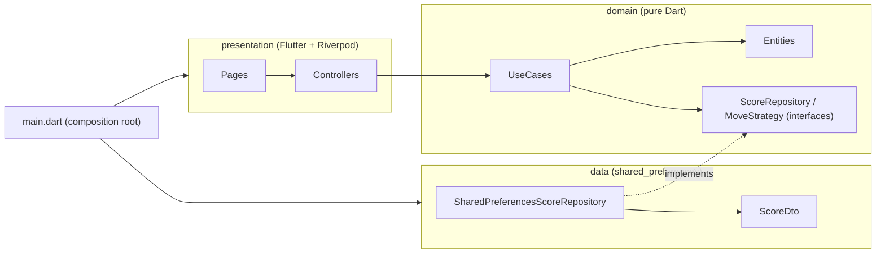

# Tic-Tac-Toe (Human vs CPU) — Design

**Date:** 2026-09-29
**Status:** Approved for planning

## 1. Brief

> Build a Tic-Tac-Toe application in Flutter that allows a player to play
> locally against a computer-controlled opponent (AI). You are free to make
> your own technical and design choices. The goal of this challenge is to
> showcase your engineering standards and your understanding of a
> production-ready Flutter application.
>
> - **Architecture:** the application should follow Clean Architecture
>   principles.
> - **Game mode:** local play only: Human vs CPU.

## 2. Product scope

### In scope

| Feature | Behaviour |
|---|---|
| Game setup | Home screen. The player picks a mark (**X** or **O**) and a difficulty (**Easy**, **Medium**, **Hard**). Defaults: X, Medium. |
| Turn order | **X always moves first.** Choosing O means the CPU opens the game. |
| Play | 3x3 board. The human taps an empty cell; the CPU answers after a **600 ms** "thinking" pause. Taps are ignored during the CPU turn, on taken cells and once the game is over. |
| Game end | Status line shows *You won!* / *CPU wins* / *It's a draw*; the winning line is highlighted; a **Play again** button restarts with the same settings. Back navigation returns to setup. |
| Score | Wins / draws / losses, **persisted across launches**, shown on the home screen and updated after each game. Unreadable stored data falls back to zero instead of crashing. |
| Localization | English (default) and French, following the device locale. |
| Theming | Material 3, light and dark themes from a single seed color. |
| Accessibility | Every cell has a screen-reader label ("Row 1, column 2: X"); the status line is a live region; board scales to any screen size and orientation (square, max 480 dp). |

### Difficulty levels

| Level | Strategy | Beatable? |
|---|---|---|
| Easy | Random empty cell. | Easily |
| Medium | Win if possible, else block the opponent's immediate win, else random. | Yes (forks) |
| Hard | Minimax (negamax) with alpha-beta pruning; faster wins score higher; deterministic tie-break (lowest index). | Never loses |

### Out of scope (YAGNI)

Two-player mode, online play, undo, resuming a game after the app is killed,
persisting the last chosen settings, board sizes other than 3x3, sound,
analytics, crash reporting (the composition root in `main.dart` is where it
would plug in), flavors, custom app icon / splash.

## 3. Architecture

Clean Architecture in three layers, one direction of dependency:



- **Domain** (`lib/domain`) — pure Dart, no Flutter import. Immutable
  entities (`Board`, `Game`, `GameStatus` sealed hierarchy, `Score`),
  AI strategies behind the `MoveStrategy` port, the `ScoreRepository` port,
  and use cases (`PlayCpuTurn`, `GetScore`, `RecordGameOutcome`).
- **Data** (`lib/data`) — `SharedPreferencesScoreRepository` implements
  `ScoreRepository`, storing a `ScoreDto` as JSON under a versioned key
  (`score.v1`).
- **Presentation** (`lib/presentation`) — Riverpod providers (the DI graph),
  `GameController` (per-game `Notifier`), `ScoreController`
  (`AsyncNotifier`), pages and widgets. **It never imports `lib/data`.**
- **Composition root** (`lib/main.dart`) — the only file that knows every
  layer: it creates `SharedPreferences` and overrides
  `scoreRepositoryProvider` with the data implementation.

### Folder structure

```text
lib/
  main.dart                      composition root
  domain/
    entities/                    Mark, Board, WinningLine, GameStatus, Game,
                                 GameSettings, Difficulty, GameOutcome, Score,
                                 InvalidMoveException
    ai/                          MoveStrategy + Random / WinOrBlock / Minimax
    repositories/                ScoreRepository (port)
    usecases/                    PlayCpuTurn, GetScore, RecordGameOutcome
  data/
    models/                      ScoreDto
    repositories/                SharedPreferencesScoreRepository
  l10n/                          app_en.arb, app_fr.arb, l10n.dart
  presentation/
    providers.dart               DI graph
    app.dart, theme.dart, labels.dart
    home/                        HomePage
    game/                        GamePage, GameController, widgets/
    score/                       ScoreBoard, ScoreController
test/                            mirrors lib/, plus helpers/
integration_test/                full game on a device
```

### Key decisions

| Topic | Decision | Why |
|---|---|---|
| State management / DI | `flutter_riverpod` 3, hand-written providers, no code generation | Compile-safe DI with test overrides; no `build_runner` for a small model. |
| Game state | Immutable `Game`; `GameController` is an `autoDispose.family` notifier keyed by `GameSettings` | One game per screen, disposed (and its pending CPU timer cancelled) when the screen closes. |
| Turn derivation | Next mark computed from mark counts on the board | One source of truth; impossible to desync turn and board. |
| Value equality | `equatable` | Readable equality for entities, settings and provider family keys. |
| Persistence | `shared_preferences`, JSON DTO, versioned key, defensive parsing | Simple local storage; DTO keeps the format out of the domain. |
| Randomness & time | `Random` and CPU delay injected through providers | Deterministic unit, widget and controller tests. |
| Lints | `very_good_analysis` 10.3, with `public_member_api_docs` and `one_member_abstracts` disabled (app code; single-method ports are intentional) | Strict, widely recognised baseline. |
| Localization | `flutter_localizations` + gen-l10n (ARB), generated files git-ignored | Standard Flutter i18n. |

## 4. Testing strategy

| Level | What | Tooling |
|---|---|---|
| Unit — domain | Board rules, status evaluation, turn order, outcomes, each AI strategy (hard: exhaustive "never loses" over every opponent line, as X and O), use cases | `flutter_test`, fakes (`FixedRandom`, `InMemoryScoreRepository`) |
| Unit — data | Round trip, versioned key, corrupted data fallback | `SharedPreferences.setMockInitialValues` |
| Unit — controllers | CPU delay, ignored taps, outcome recording, restart, timer cancelled on dispose | `ProviderContainer.test`, `fake_async` |
| Widget | Board rendering / taps / semantics / sizing, status text, game page flow, home page setup and score, French locale | `WidgetTester`, `pumpApp` helper |
| Integration | Full game on a device against the Hard CPU, score persisted and shown | `integration_test` |

Coverage gate in CI: **≥ 90 %** line coverage, generated l10n excluded.

## 5. Delivery

- GitHub Actions: `dart format --set-exit-if-changed`, `flutter analyze`,
  `flutter test --coverage`, coverage gate.
- README documenting setup, architecture, decisions and trade-offs.

## 6. Global constraints

- Flutter **3.44.1** (stable), Dart SDK constraint **`^3.12.1`**.
- Package name **`tic_tac_toe`**, org **`dev.lucchini`**, platforms
  **android, ios**.
- Dependencies: `equatable ^3.0.0`, `flutter_riverpod ^3.4.3`,
  `shared_preferences ^2.5.5`, `intl ^0.20.2`, `flutter_localizations` (sdk).
  Dev: `very_good_analysis ^10.3.0`, `fake_async ^1.3.3`, `flutter_test`,
  `integration_test` (sdk).
- Package imports only (`package:tic_tac_toe/...`) in `lib/`; 80-char lines;
  `dart format` clean; `flutter analyze` → "No issues found!".
- `lib/domain` must not import Flutter, Riverpod or `lib/data`;
  `lib/presentation` must not import `lib/data`.
